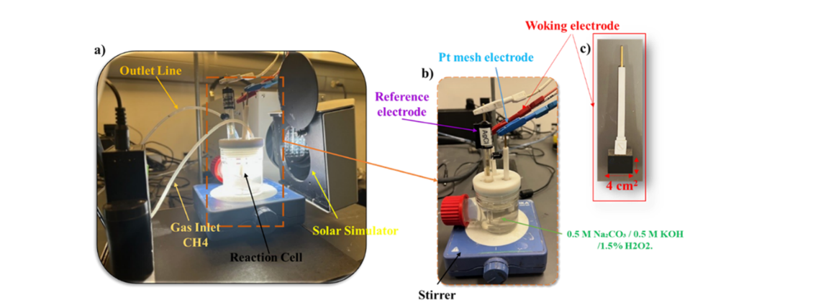
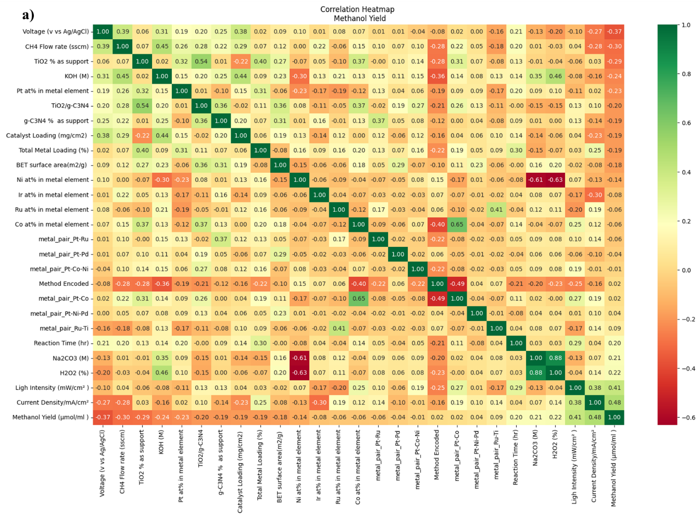
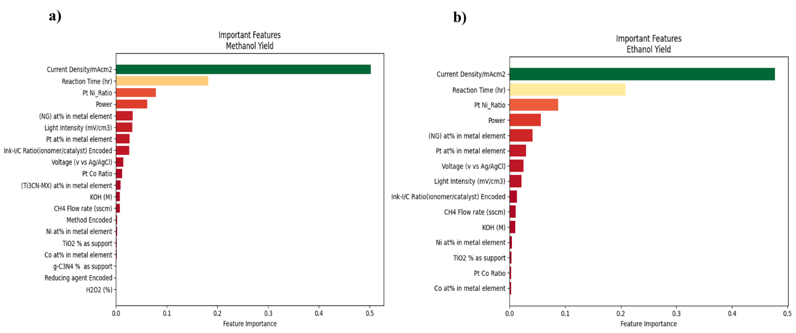

# Machine Learning-Driven Optimization of Multi-Metal Electrocatalysts and Operating Conditions for Methane-to-Alcohol Conversion

## From Experimental Trial-and-Error to Data-Driven Catalyst Discovery

<p>
Scaling electrochemical conversion systems from laboratory experiments to pilot-scale operation requires a combination of engineering validation, experimental optimization, and data-driven analysis. During the development of methane-to-alcohol conversion technologies, increasing reactor scale introduces new challenges related to mass transport, catalyst utilization, current distribution, reaction kinetics, and long-term operational stability. These factors can significantly influence methane activation, product selectivity, and alcohol yield.
</p>

<p>
To address these challenges, this project applies a machine learning-driven approach to analyze experimental electrochemical data, identify critical catalyst and operating parameters, and optimize multi-metal electrocatalyst combinations for efficient methane conversion. By integrating experimental insights with predictive modeling, the framework reduces trial-and-error requirements and accelerates data-driven catalyst discovery.
</p>



---

# Project Overview

## Accelerating Methane Valorization Using Machine Learning

The conversion of methane (CH₄) into value-added chemicals such as methanol and ethanol is an emerging pathway for sustainable chemical production. However, discovering efficient electrocatalysts remains highly challenging due to the complex interactions between:

- Catalyst composition
- Metal-metal synergy
- Catalyst loading
- Electrode properties
- Applied voltage
- Current density
- Light intensity
- Reaction time
- Electrolyte environment

Traditional catalyst development relies on experimental trial-and-error approaches, where hundreds of catalyst combinations and operating conditions must be experimentally tested.

This approach is:

- Time-consuming
- Expensive
- Limited by experimental capacity
- Unable to fully explore complex catalyst design spaces


To overcome these limitations, this project developed an **end-to-end Machine Learning framework** to predict methane-to-alcohol conversion performance and identify optimal catalyst combinations.

The framework integrates:

```
Experimental Electrochemistry

          +

Machine Learning

          +

Model Interpretation

          +

Optimization Algorithms

          ↓

Data-Driven Catalyst Discovery
```

---

# Project Objectives

The main objective was to develop predictive ML models capable of learning the nonlinear relationship between:

```
Catalyst Design Parameters

            +

Electrochemical Operating Conditions

            ↓

Methanol and Ethanol Production
```

The ML framework was designed to answer:

### Catalyst Discovery Questions

- Which multi-metal catalyst provides the highest alcohol yield?
- How do metal combinations influence methane activation?
- Can ML identify promising catalysts before experimental validation?


### Process Optimization Questions

- Which operating conditions maximize methane conversion?
- What parameters control methanol and ethanol selectivity?
- Can experimental screening be reduced using predictive modeling?


---

# Scientific Challenge

Methane conversion performance depends on highly nonlinear interactions:

```
Catalyst Composition

Pt + Co + Ni + Pd + Supports

             +

Operating Conditions

Voltage
Current Density
Light Intensity
Reaction Time

             ↓

CH₄ Activation

             ↓

Methanol / Ethanol Yield
```

Many important interactions cannot be captured using traditional linear analysis.

For example:

- Pt loading alone showed weak correlation with performance
- Co loading alone showed weak correlation
- Pt-Co synergy produced significantly higher activity

Therefore, machine learning was required to capture hidden nonlinear relationships.

---

# Dataset Description

Experimental data from methane conversion experiments were collected and transformed into a machine learning dataset.

## Dataset Characteristics

| Parameter | Description |
|-|-|
| Dataset type | Experimental electrochemical dataset |
| Samples |  experimental data |
| Catalyst candidates | 25 multi-metal systems |
| Prediction targets | Methanol and Ethanol yield |
| Input variables | 33 catalyst and operating parameters |
| ML Task | Supervised regression |


---

# Feature Engineering

The input dataset included catalyst, electrochemical, and environmental variables.

---

# 1. Catalyst Design Features

The ML model considered:

### Metal Composition

- Pt-based catalysts
- Co-based catalysts
- Ni-based catalysts
- Pd-containing catalysts
- Multi-metal combinations

Examples:

```
Pt

Pt-Co

Pt-Ni-Pd

Ru-Pd

Pt-Co-Ni
```


### Catalyst Properties

- Metal loading
- Total metal concentration
- Catalyst type
- Electrode characteristics
- Support materials


Examples:

- TiO₂
- g-C₃N₄
- TiO₂/g-C₃N₄ nanohybrid


---

# 2. Electrochemical Operating Parameters

Process variables included:

| Parameter | Role |
|-|-|
| Voltage | Electrochemical driving force |
| Current density | Reaction rate control |
| Light intensity | Photo-assisted activation |
| Reaction time | Product accumulation |
| Temperature | Reaction environment |
| Electrolyte composition | Ionic conductivity |
| Gas conditions | Methane conversion environment |


---

# Target Variables

Two regression models were developed:


## Model 1: Methanol Prediction

Input:

```
Catalyst + Operating Conditions

          ↓

Methanol Yield
```


## Model 2: Ethanol Prediction

Input:

```
Catalyst + Operating Conditions

          ↓

Ethanol Yield
```

---

# Machine Learning Workflow


The complete workflow:

```
Experimental Dataset

        ↓

Data Cleaning

        ↓

Feature Engineering

        ↓

Categorical Encoding

        ↓

Feature Scaling

(StandardScaler)

        ↓

Train/Test Split

80% / 20%

        ↓

Regression Model Training

        ↓

Hyperparameter Optimization

(GridSearchCV)

        ↓

5-Fold Cross Validation

        ↓

Performance Evaluation

        ↓

Feature Importance Analysis

        ↓

Catalyst Ranking & Optimization
```

---

# Data Preprocessing

The preprocessing pipeline included:


## Missing Value Handling

- Identification of incomplete records
- Data quality verification


## Feature Transformation

Categorical catalyst information was converted into numerical features.


## Feature Scaling

Standardization was performed using:

```
StandardScaler()
```

to improve model convergence and reduce feature magnitude differences.


---

# Machine Learning Model Development

Four regression algorithms were developed and benchmarked.


---

# 1. Random Forest Regression (RF)

Random Forest was selected because of its ability to capture nonlinear catalyst-performance relationships.


Advantages:

- Handles noisy experimental data
- Reduces variance through ensemble learning
- Provides feature importance ranking


Optimized parameters:

- Number of estimators
- Maximum depth
- Minimum sample split
- Minimum leaf samples


---

# 2. Gradient Boosting Regression (GBoost)

Gradient Boosting was selected as the final predictive model due to its superior ability to capture nonlinear interactions.


Advantages:

- High predictive accuracy
- Effective for small scientific datasets
- Captures complex feature interactions
- Controls overfitting through regularization


Optimized parameters:

- Learning rate
- Tree depth
- Number of estimators
- Subsampling ratio
- Minimum sample split


---

# 3. Support Vector Regression (SVR)

SVR was evaluated because of its strong performance for limited experimental datasets.


Configuration:

- RBF kernel
- Optimized C parameter
- Gamma optimization
- Epsilon tuning


Advantages:

- Strong generalization
- Handles nonlinear relationships
- Effective in high-dimensional spaces


---

# 4. Multi-Layer Perceptron MLP 

A Multi-Layer Perceptron regression model was developed.


Architecture:

```
Input Features

       ↓

Hidden Layer

(30 neurons)

       ↓

Hidden Layer

(15 neurons)

       ↓

Output

Methanol / Ethanol Prediction
```


Optimization parameters:

- Activation function
- Learning rate
- Hidden layer size
- L2 regularization


---

<h2>Hyperparameter Optimization</h2>

<p>
Machine learning models were optimized through a systematic hyperparameter tuning workflow involving 
<strong>feature engineering, StandardScaler normalization, and GridSearchCV with 5-fold cross-validation</strong>.
This approach improved model robustness, reduced overfitting, and prevented data leakage during model development.
Model selection was based on achieving the highest validation <strong>R² score</strong> and the lowest 
<strong>RMSE</strong>. Regularization strategies, including L2 penalties and early stopping, were applied for 
complex models such as <strong>Gradient Boosting and ANN (MLPRegressor)</strong> to improve generalization.
The optimized hyperparameter configurations for methanol and ethanol prediction are summarized in 
<strong>Tables 4S and 5S</strong>.
</p>


<h3>Hyperparameter Search Space</h3>

<p>
A comprehensive parameter search was performed for four regression algorithms:
<strong>ANN (MLPRegressor), Support Vector Regression (SVR), Random Forest (RF), and Gradient Boosting Regression</strong>.
The optimization ranges are summarized below.
</p>


<table border="1" cellpadding="8" cellspacing="0">

<thead>
<tr>
    <th>Algorithm</th>
    <th>Hyperparameter</th>
    <th>Optimization Range</th>
</tr>
</thead>

<tbody>

<tr>
<td rowspan="4"><strong>ANN (MLPRegressor)</strong></td>
<td>Activation Function</td>
<td>ReLU, Tanh, Logistic</td>
</tr>

<tr>
<td>Hidden Layer Architecture</td>
<td>(20,), (30,), (20,10), (30,15)</td>
</tr>

<tr>
<td>Learning Rate</td>
<td>0.001, 0.01, 0.1</td>
</tr>

<tr>
<td>Alpha (L2 Regularization)</td>
<td>0.0001, 0.001, 0.01</td>
</tr>


<tr>
<td rowspan="4"><strong>Support Vector Regression (SVR)</strong></td>
<td>Kernel</td>
<td>RBF, Linear</td>
</tr>

<tr>
<td>C Parameter</td>
<td>0.1, 1, 6, 8, 10</td>
</tr>

<tr>
<td>Epsilon</td>
<td>0.01, 0.1, 0.2</td>
</tr>

<tr>
<td>Gamma</td>
<td>Scale, Auto, 0.1, 0.01</td>
</tr>


<tr>
<td rowspan="4"><strong>Random Forest (RF)</strong></td>
<td>Number of Estimators</td>
<td>100, 200, 300</td>
</tr>

<tr>
<td>Maximum Depth</td>
<td>2, 5, 6, 8, 10</td>
</tr>

<tr>
<td>Minimum Sample Split</td>
<td>2, 4, 5, 10</td>
</tr>

<tr>
<td>Minimum Samples Leaf</td>
<td>1, 2, 5</td>
</tr>


<tr>
<td rowspan="5"><strong>Gradient Boosting Regression</strong></td>
<td>Learning Rate</td>
<td>0.01, 0.05, 0.1</td>
</tr>

<tr>
<td>Maximum Depth</td>
<td>3, 5, 8</td>
</tr>

<tr>
<td>Number of Estimators</td>
<td>50, 100, 150, 200, 300</td>
</tr>

<tr>
<td>Subsample Ratio</td>
<td>0.8, 0.9, 1.0</td>
</tr>

<tr>
<td>Minimum Sample Split</td>
<td>2, 3, 4, 5</td>
</tr>

</tbody>

</table>


<h3>Optimized Model Hyperparameters</h3>

<p>
The optimal hyperparameter combinations obtained from GridSearchCV are presented below for 
methanol and ethanol prediction models.
</p>


<table border="1" cellpadding="8" cellspacing="0">

<thead>
<tr>
<th>Algorithm</th>
<th>Optimized Parameter</th>
<th>Methanol Prediction</th>
<th>Ethanol Prediction</th>
</tr>
</thead>


<tbody>


<tr>
<td rowspan="4"><strong>ANN (MLPRegressor)</strong></td>
<td>Activation Function</td>
<td>ReLU</td>
<td>ReLU</td>
</tr>

<tr>
<td>Learning Rate</td>
<td>0.1</td>
<td>0.01</td>
</tr>

<tr>
<td>Hidden Layer Architecture</td>
<td>(30,15)</td>
<td>(30,15)</td>
</tr>

<tr>
<td>Alpha (L2 Regularization)</td>
<td>0.001</td>
<td>0.0001</td>
</tr>


<tr>
<td rowspan="4"><strong>SVR</strong></td>
<td>Kernel</td>
<td>RBF</td>
<td>RBF</td>
</tr>

<tr>
<td>C Parameter</td>
<td>6</td>
<td>10</td>
</tr>

<tr>
<td>Epsilon</td>
<td>0.2</td>
<td>0.01</td>
</tr>

<tr>
<td>Gamma</td>
<td>Scale</td>
<td>Scale</td>
</tr>


<tr>
<td rowspan="4"><strong>Random Forest</strong></td>
<td>Number of Estimators</td>
<td>300</td>
<td>200</td>
</tr>

<tr>
<td>Maximum Depth</td>
<td>6</td>
<td>8</td>
</tr>

<tr>
<td>Minimum Sample Split</td>
<td>2</td>
<td>4</td>
</tr>

<tr>
<td>Minimum Samples Leaf</td>
<td>1</td>
<td>1</td>
</tr>


<tr>
<td rowspan="5"><strong>Gradient Boosting Regression</strong></td>
<td>Maximum Depth</td>
<td>5</td>
<td>5</td>
</tr>

<tr>
<td>Learning Rate</td>
<td>0.01</td>
<td>0.1</td>
</tr>

<tr>
<td>Number of Estimators</td>
<td>200</td>
<td>300</td>
</tr>

<tr>
<td>Subsample Ratio</td>
<td>0.8</td>
<td>0.9</td>
</tr>

<tr>
<td>Minimum Sample Split</td>
<td>5</td>
<td>5</td>
</tr>


</tbody>

</table>


<h3>Model Optimization Strategy</h3>

<p>
The optimized models were selected according to the following criteria:
</p>

<ul>

<li>
<strong>High prediction R²:</strong> Ability to explain experimental variability and capture catalyst-performance relationships.
</li>

<li>
<strong>Low RMSE:</strong> Minimize prediction errors between experimental and predicted alcohol yields.
</li>

<li>
<strong>Cross-validation stability:</strong> Ensure reliable performance on unseen experimental conditions.
</li>

<li>
<strong>Reduced overfitting:</strong> Achieved through regularization, controlled model complexity, and validation strategies.
</li>

</ul>


<p>
Among all evaluated algorithms, the optimized 
<strong>Gradient Boosting Regression model</strong> achieved the best predictive performance.
Its ability to capture nonlinear interactions between multi-metal catalyst composition, electrochemical operating parameters, and methane-to-alcohol conversion performance made it the most reliable model for catalyst prediction and optimization.
</p>
---

# Model Performance Comparison

<h3>Model Benchmarking and Performance Comparison</h3>

<p>
Multiple regression models were evaluated using training and testing metrics, including 
<strong>R² score and RMSE</strong>, to assess predictive accuracy and model robustness. 
Among all algorithms, <strong>Gradient Boosting Regression (GBoost)</strong> achieved the best overall performance for both methanol and ethanol prediction.
</p>

<ul>
    <li>
        <strong>Methanol prediction:</strong> GBoost achieved the highest prediction accuracy 
        (<strong>R² = 0.9139, RMSE = 0.9643</strong>), outperforming ANN, RF, and SVR.
    </li>
    <li>
        <strong>Ethanol prediction:</strong> GBoost again provided the best performance 
        (<strong>R² = 0.9066, RMSE = 0.7891</strong>), demonstrating strong generalization capability.
    </li>
</ul>

<p>
The superior performance of GBoost was attributed to its ability to capture complex nonlinear relationships between 
<strong>catalyst composition, Pt–Co interactions, voltage, light intensity, and electrochemical operating conditions</strong>, 
while controlling overfitting through optimized tree depth and regularization.
</p>

<p>
Although ANN, RF, and SVR provided reasonable predictive capability, their larger differences between training and testing performance indicated weaker generalization, particularly for the limited experimental dataset.
</p>


| Model | Train R² | Test R² | Test RMSE |
|-|-|-|-|
| ANN |0.9381|0.8916|1.0819|
| SVR |0.9756|0.8802|1.1375|
| RF |0.9691|0.8798|1.1395|
| **GBoost** |**0.9670**|**0.9139**|**0.9643**|


---

## Ethanol Prediction Performance


| Model | Train R² | Test R² | Test RMSE |
|-|-|-|-|
| ANN |0.9512|0.8943|0.8394|
| SVR |0.9806|0.8828|0.8839|
| RF |0.9571|0.8517|0.9943|
| **GBoost** |**0.9887**|**0.9066**|**0.7891**|


---


# Model Validation Visualization


## Predicted vs Experimental Results

<h3>Model Performance Insights</h3>

<p>
The prediction–actual parity plots  demonstrated that 
<strong>Gradient Boosting Regression (GBoost)</strong> achieved the best predictive performance for methanol production, 
with a test <strong>R² = 0.9139</strong> and <strong>RMSE = 0.9643</strong>. The predictions closely followed the ideal 
<strong>y = x</strong> relationship, indicating strong agreement between experimental and predicted values.
</p>

<p>
The MLP model also showed strong performance (<strong>R² = 0.8916</strong>); however, its larger gap between training and testing performance suggested mild overfitting due to model complexity and limited dataset size. 
RF and SVR showed larger performance reductions from training to testing, indicating weaker generalization.
</p>


---

# Correlation Analysis

<h3>Correlation Analysis and Engineering Insights</h3>

<p>
The correlation heatmap (Figure 9S) revealed the relationships between reaction parameters and alcohol production. 
Methanol yield showed positive correlations with <strong>current density (r = 0.48)</strong> and 
<strong>light intensity (r = 0.41)</strong>, while voltage exhibited a negative correlation 
(<strong>r = -0.37</strong>), indicating the presence of an optimal operating potential.
</p>

<p>
Although individual catalyst parameters showed weak linear correlations, the ML models successfully captured 
important nonlinear interactions, particularly the synergistic effects of <strong>Pt–Co catalyst composition</strong>, 
operating conditions, and support materials. Similar trends were observed for ethanol prediction, confirming the 
ability of ML to identify complex relationships beyond traditional correlation analysis.
</p>



---

# Feature Importance Analysis
<h3>Feature Importance Analysis and ML Interpretability</h3>

<p>
Feature importance analysis using the optimized <strong>Gradient Boosting model</strong> (Figure 12a-b) identified the key 
parameters controlling methanol and ethanol production. The most influential variables included 
<strong>current density, voltage, reaction time, and light intensity</strong>, highlighting their critical roles in 
electrochemical methane activation and photo-assisted reaction kinetics.
</p>

<p>
Among catalyst-related factors, <strong>Pt–Co composition and catalyst loading</strong> showed significant contributions, 
confirming the superior performance of the <strong>Pt–Co/TiO₂/g-C₃N₄ nanohybrid catalyst</strong>. In contrast, support materials 
and electrolyte components showed lower importance compared with metal composition and operating conditions.
</p>

<p>
These results demonstrate that ML can capture complex nonlinear interactions beyond conventional correlation analysis, 
providing valuable insights for catalyst design, process optimization, and experimental validation.
</p>




## Methanol Production

Top influencing parameters:

1. Current density
2. Voltage
3. Reaction time
4. Light intensity
5. Catalyst loading
6. Metal composition


## Ethanol Production

Similar trends were observed, confirming model consistency.


---

# Catalyst Ranking Using Machine Learning


<h3>ML-Based Catalyst Ranking</h3>

<p>
An ML-based framework was developed to rank multi-metal electrocatalysts based on 
<strong>methanol/ethanol production and metal loading</strong>, reducing experimental screening efforts. 
Using data from <strong>25 catalyst candidates</strong>, the model identified high-performing combinations, with 
<strong>Ti (TiCN)</strong> achieving the highest score (100), followed by <strong>Ru–Pd, Pt–Ni–Pd, and Pt–Co</strong>.
</p>

<p>
Based on ML prediction and catalytic synergy, <strong>Pt–Co</strong> was selected for experimental validation due to its 
potential to enhance CH₄ activation while reducing noble metal usage.
</p>


| Rank | Catalyst | Performance Score |
|-|-|-|
|1|Ti(TiCN)|100|
|2|Ru-Pd|29.46|
|3|Pt-Ni-Pd|21.66|
|4|Pt-Co|13.85|
|5|Pt|6.50|
|6|Pt-Co-Ni|1.46|


---


# Engineering Insights


Machine learning revealed:


### Catalyst Effect

Pt-Co alloy showed enhanced methane activation due to synergistic metal interaction.


### Process Parameters

The most influential parameters were:

- Current density
- Voltage
- Reaction time
- Light intensity


### Nonlinear Behavior

The ML model captured:

- Catalyst synergy
- Voltage optimization window
- Complex reaction interactions


---

# Technologies Used


## Programming

- Python
- Pandas
- NumPy


## Machine Learning

- Scikit-learn
- Random Forest
- Gradient Boosting
- SVR
- MLPRegressor


## Optimization

- GridSearchCV
- Bayesian Optimization


## Explainability

- Feature Importance
- SHAP


## Visualization

- Matplotlib
- Seaborn
- Plotly


---

# Project Impact


This project demonstrates how machine learning can transform methane conversion research from:

```
Experimental Trial-and-Error

            ↓

Data-Driven Catalyst Discovery
```


By combining:

✅ Experimental electrochemistry  
✅ Data preprocessing  
✅ Machine learning modeling  
✅ Optimization algorithms  


