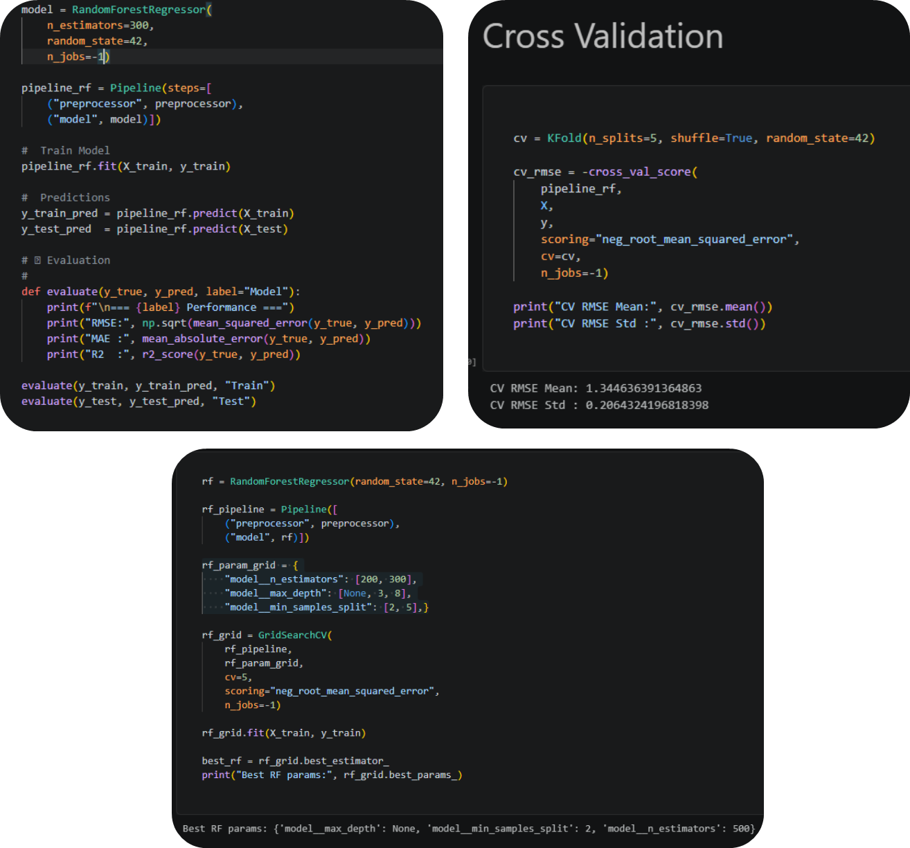
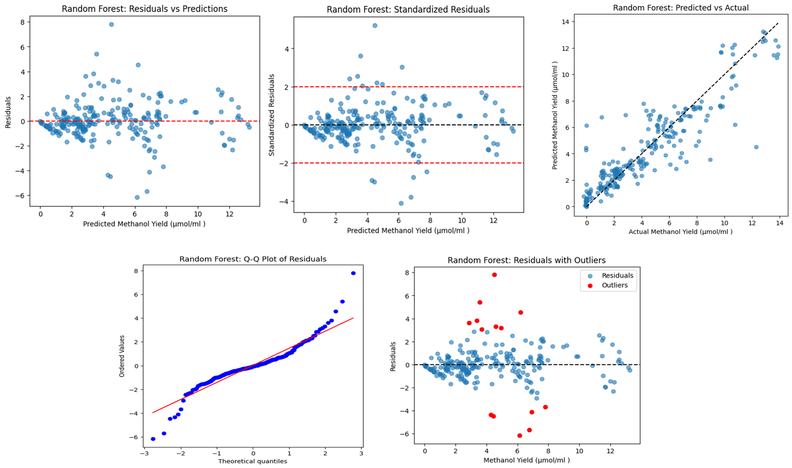
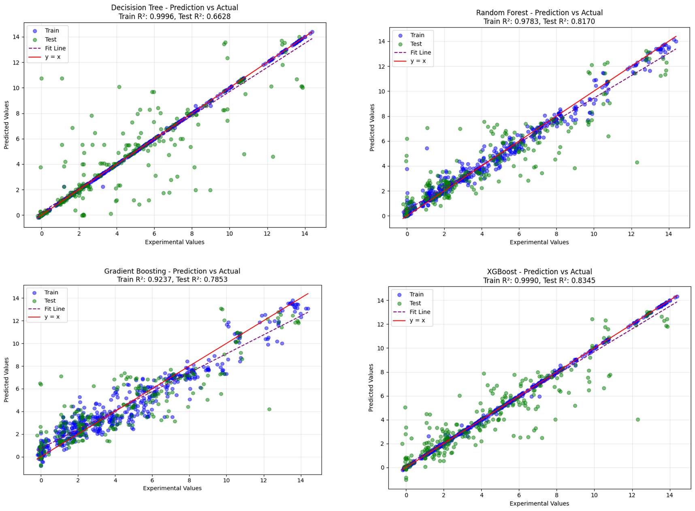
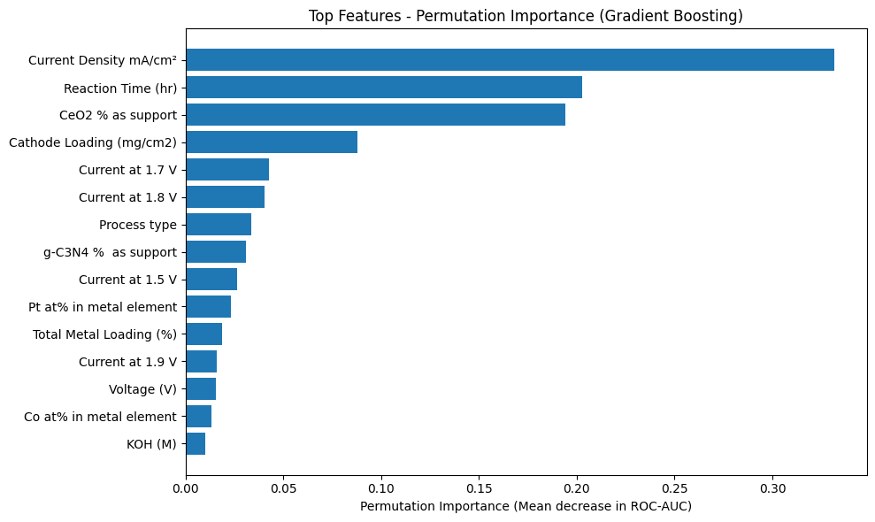
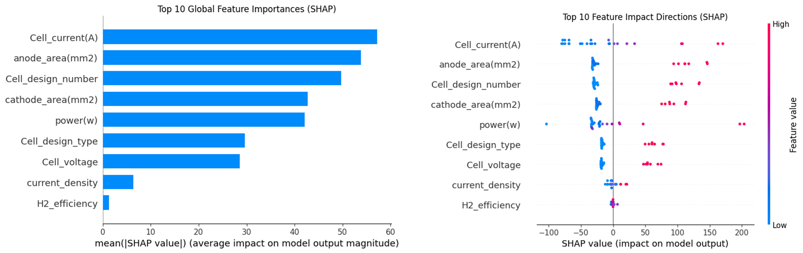

<h1>Machine Learning Models for CH₄ Electrolyzer Process Optimization & Scale-Up</h1>
<h2>A Data-Driven Framework for Electrochemical Methane Conversion Optimization</h2>

    

<h3>Objective of the Work</h3>

This project develops an <strong>ETL-driven ensemble machine learning framework</strong> to predict
<strong>methanol and ethanol yields</strong> from the <strong>electrochemical conversion of methane (CH₄)</strong>,
while supporting the <strong>scale-up of electrolyzers from 5 cm² laboratory cells to 25 cm² pilot-scale systems</strong>.
The workflow integrates <strong>data engineering (ETL), preprocessing, feature engineering, statistical analysis,
and ensemble regression models</strong> to optimize catalyst performance and operating conditions.

Experimental data from CH₄ electrolyzers were used to develop predictive models based on
<strong>Decision Tree, Random Forest, Gradient Boosting, and XGBoost</strong>. Model performance was evaluated using
<strong>R²</strong>, <strong>RMSE</strong>, <strong>MAE</strong>, and <strong>k-fold cross-validation</strong>, while feature analysis identified the
most influential operating parameters affecting methanol and ethanol production.

Overall, this framework provides a <strong>data-driven approach</strong> for predicting alcohol production,
optimizing electrochemical methane conversion, and enabling reliable <strong>electrolyzer scale-up from 5 cm² to
25 cm²</strong>, improving process understanding, catalyst optimization, and pilot-scale performance.

<h3>Why Ensemble Learning?</h3>

Electrochemical CH₄ conversion involves <strong>complex nonlinear relationships</strong> between catalyst composition,
operating conditions, and reactor performance. A single machine learning model may not fully capture these interactions,
leading to reduced prediction accuracy and poor generalization during electrolyzer scale-up.

<strong>Ensemble learning</strong> combines multiple predictive models to improve <strong>accuracy, robustness, and reliability</strong>.
In this project, <strong>Decision Tree, Random Forest, Gradient Boosting, and XGBoost</strong> were evaluated to predict
<strong>methanol and ethanol yields</strong> while minimizing overfitting and improving performance across different operating conditions.

<table border="1" cellpadding="6" cellspacing="0">
<tr>
<th>Benefit</th>
<th>Application to CH₄ Electrolyzer</th>
</tr>

<tr>
<td>Higher Prediction Accuracy</td>
<td>Improves methanol and ethanol yield prediction.</td>
</tr>

<tr>
<td>Better Generalization</td>
<td>Produces reliable predictions for 5 cm² and 25 cm² electrolyzers.</td>
</tr>

<tr>
<td>Reduced Overfitting</td>
<td>Combines multiple learners for more stable predictions.</td>
</tr>

<tr>
<td>Feature Importance</td>
<td>Identifies influential variables such as current density, voltage, pressure, and catalyst loading.</td>
</tr>

<tr>
<td>Process Optimization</td>
<td>Supports catalyst optimization and operating-condition selection for pilot-scale implementation.</td>
</tr>

</table>

Overall, ensemble learning provides a robust, data-driven framework for optimizing electrochemical methane conversion and supporting reliable electrolyzer scale-up from <strong>5 cm² laboratory cells</strong> to <strong>25 cm² pilot-scale systems</strong>.

<h3>Key Highlights</h3>
<ul>
    <li><b>Dataset Size:</b> 816 rows × 41 variables</li>
    <li><b>Best Model:</b> XGBoost</li>
    <li><b>Test R²:</b> 0.835</li>
    <li><b>Test RMSE:</b> 1.436</li>
    <li><b>Dominant Feature:</b> CeO₂ % as support (34.8%)</li>
    <li><b>Process Types:</b> Electrolyzer, Electrochemical devices, Solar light</li>
</ul>

<h2 id="dataset">2. Dataset Description</h2>
<h3>Data Source Structure</h3>

The original Excel file contains <b>4 separate sheets</b> representing different experimental subsets:

<ul>
    <li>Electrolyzer experiments (primary)</li>
    <li>Electrochemical devices</li>
    <li>Solar-assisted conditions</li>
    <li>Additional catalyst/process records</li>
</ul>

All sheets were extracted individually, standardized to a unified schema, and then concatenated into one final master dataset for EDA and machine learning.

<h3>Key Dataset Components</h3>
<ul>
    <li><b>Catalysts:</b> Pt, Co, Ni, Ru, Pd, Ir-based and hybrid catalyst compositions (e.g., Pt/C, Ni–TiO₂, Pt–Co/TiO₂/g-C₃N₄)</li>
    <li><b>Supports:</b> TiO₂, g-C₃N₄, carbon-based supports such as graphene</li>
    <li><b>Experimental Conditions:</b> Voltage, current density, electrolyte type/concentration, CH₄ flow rate, operating pressure, reaction time, light intensity</li>
    <li><b>Process Types:</b> Electrolyzer, Electrochemical devices, Solar light</li>
    <li><b>Outputs:</b> Methanol and ethanol yields, current response at multiple voltage points</li>
</ul>

<h3>Dataset Snapshot (First 5 rows)</h3>
<table border="1" cellpadding="5">
    <tr>
        <th>Cathod Catalyst</th>
        <th>Anode Catalyst</th>
        <th>Pt at%</th>
        <th>Co at%</th>
        <th>Ni at%</th>
        <th>Current Density mA/cm²</th>
        <th>Reaction Time (hr)</th>
        <th>Process type</th>
    </tr>
    <tr>
        <td>Ni-Tio2</td>
        <td>IrO₂</td>
        <td>-1</td>
        <td>1</td>
        <td>89</td>
        <td>31.56</td>
        <td>2</td>
        <td>Electrolyzer</td>
    </tr>
    <tr>
        <td>Pd-Ni/CeO2</td>
        <td>IrO₂</td>
        <td>1</td>
        <td>1</td>
        <td>1</td>
        <td>86.84</td>
        <td>6</td>
        <td>Electrolyzer</td>
    </tr>
    <tr>
        <td>Pt-Co/TiO2/g-C3N4</td>
        <td>NiFeO2</td>
        <td>48</td>
        <td>51</td>
        <td>0</td>
        <td>80.22</td>
        <td>9</td>
        <td>Solar light</td>
    </tr>
</table>

<h2 id="objectives">3. Project Objectives</h2>
<h3>Primary Objective</h3>

Develop a robust ETL-driven ensemble regression framework for predicting <b>methanol and ethanol yields</b> from electrochemical methane conversion experiments.

<h3>Machine Learning Tasks</h3>
<ul>
    <li><b>Primary Task:</b> Predict methanol yield from catalyst composition and electrochemical operating conditions</li>
    <li><b>Secondary Task:</b> Predict ethanol yield using the same feature space</li>
    <li>Applied <b>k-fold cross-validation</b> to ensure generalization</li>
</ul>

<h3>Feature Analysis &amp; Statistical Tests</h3>
<ul>
    <li>Linear regression analysis to identify key predictors</li>
    <li>T-tests to assess statistical significance of categorical groups</li>
    <li>ANOVA to analyze variance between catalyst formulations or device types</li>
    <li>Correlation heatmaps to visualize linear dependencies</li>
</ul>

<h3>SHAP Analysis for Model Interpretability</h3>
<ul>
    <li>Computed SHAP values to quantify feature contributions</li>
    <li>Generated global feature importance plots</li>
    <li>Produced local SHAP explanations for individual predictions</li>
</ul>

<h2 id="etl">4. Data Engineering &amp; ETL Pipeline</h2>
<h3>Data Preprocessing &amp; Feature Engineering</h3>
<table border="1" cellpadding="5">
    <tr><th>Step</th><th>Description</th></tr>
    <tr><td>Missing Value Handling</td><td>Standardized missing values (NANE, NONE, blanks); corrected mixed numeric/string columns</td></tr>
    <tr><td>Unit Resolution</td><td>Resolved unit inconsistencies (light intensity, voltage, current density)</td></tr>
    <tr><td>Categorical Cleaning</td><td>Cleaned categorical labels for consistent feature representation</td></tr>
    <tr><td>Normalization &amp; Scaling</td><td>Applied normalization and scaling to numerical variables</td></tr>
    <tr><td>Sparsity Handling</td><td>Handled sparsity in catalyst composition using aggregation and structured grouping</td></tr>
    <tr><td>Feature Reduction</td><td>Removed redundant and low-information columns</td></tr>
    <tr><td>Outlier Detection</td><td>Detected and removed extreme outliers caused by experimental noise</td></tr>
    <tr><td>Correlation Analysis</td><td>Performed correlation analysis and variance-based filtering</td></tr>
</table>

<h3>Dataset Design</h3>

<b>Input Features:</b> Catalyst composition (Pt at%, Co wt.%, TiO₂ wt.%, g-C₃N₄ wt.%, metal ratios), reaction conditions (voltage, reaction time, CH₄ flow rate, electrolyte concentration, current density), device indicators, material characterization parameters.

<b>Target Variables:</b> Methanol yield (μmol/ml), Ethanol yield (μmol/ml).

<h3>Preprocessing Pipeline</h3>
<pre>
numeric_transformer = Pipeline(steps=[
    ('imputer', SimpleImputer(strategy='median')),
    ('scaler', StandardScaler())])
categorical_transformer = Pipeline(steps=[
    ('imputer', SimpleImputer(strategy='most_frequent'))])
preprocessor = ColumnTransformer(
    transformers=[
        ('num', numeric_transformer, numeric_features),
        ('cat', categorical_transformer, categorical_features)],
    remainder='passthrough')
</pre>

<h2 id="stats">5. Statistical Analysis</h2>
<h3>Linear Regression Results</h3>

<b>1. Voltage vs Methanol Yield</b> 
Slope: -2.664, R²: 0.126, p-value: 1.3997e-25 
<em>Interpretation:</em> Statistically significant but weak linear relationship; low R² suggests other factors also influence methanol yield.

<b>2. Current Density vs Methanol Yield</b> 
Slope: 0.0565, R²: 0.175, p-value: 8.8250e-36 
<em>Interpretation:</em> Significant positive correlation; low R² indicates non-linear effects or interactions.

<b>3. CH₄ Flow Rate vs Ethanol Yield</b> 
Slope: -0.948, R²: 0.001, p-value: 0.5072 
<em>Interpretation:</em> No statistically significant correlation; justifies use of ensemble machine learning models.

<h3>OLS Regression - Cathode Loading vs Methanol Yield</h3>
<table border="1" cellpadding="5">
    <tr><th>Metric</th><th>Value</th></tr>
    <tr><td>F-statistic</td><td>86.6 (p &lt; 0.001)</td></tr>
    <tr><td>Coefficient</td><td>-0.1209</td></tr>
    <tr><td>t-value</td><td>-9.31</td></tr>
    <tr><td>R²</td><td>0.096</td></tr>
</table>

<b>Key Findings:</b> Increasing cathode loading reduces methanol yield by ~0.12 µmol/ml per mg/cm². Only 9.6% of variability explained → other parameters play larger role.

<h3>T-Test Analysis</h3>
<table border="1" cellpadding="5">
    <tr><th>Comparison</th><th>t-statistic</th><th>p-value</th><th>Interpretation</th></tr>
    <tr><td>AEM–Sustainion X37-220 vs Reference</td><td>3.56</td><td>4.04 × 10⁻³</td><td>Significant membrane effect on current density</td></tr>
    <tr><td>High vs Low Cathode Loading</td><td>6.77</td><td>2.62 × 10⁻¹¹</td><td>Strong effect on methanol yield</td></tr>
</table>

<h3>ANOVA Results</h3>
<table border="1" cellpadding="5">
    <tr><th>Effect</th><th>F-statistic</th><th>p-value</th><th>Interpretation</th></tr>
    <tr><td>Electrolyte on Methanol Yield</td><td>9.53</td><td>9.38 × 10⁻⁴⁰</td><td>Overwhelming evidence of significant effect</td></tr>
    <tr><td>Process Type on Ethanol Yield</td><td>38.25</td><td>1.34 × 10⁻¹⁶</td><td>Very strong effect on ethanol formation</td></tr>
</table>

<h2 id="ml">6. Machine Learning Pipeline</h2>

<h3>Hyperparameter Optimization</h3>

Tree-based ensemble models were optimized using <strong>GridSearchCV with cross-validation</strong> to improve prediction accuracy and reduce overfitting. The optimization focused on tree depth, number of estimators, learning rate, and sampling parameters.

<table border="1" cellpadding="8" cellspacing="0">

<thead>
<tr>
<th>Model</th>
<th>Optimized Hyperparameters</th>
</tr>
</thead>

<tbody>

<tr>
<td><strong>Decision Tree</strong></td>
<td>max_depth, min_samples_split, min_samples_leaf</td>
</tr>

<tr>
<td><strong>Random Forest</strong></td>
<td>n_estimators, max_depth, min_samples_split</td>
</tr>

<tr>
<td><strong>Gradient Boosting</strong></td>
<td>n_estimators, learning_rate, max_depth, subsample</td>
</tr>

</tbody>

</table>

<h3>Best Model Parameters</h3>

<table border="1" cellpadding="8" cellspacing="0">

<tr>
<th>Model</th>
<th>Final Parameters</th>
</tr>

<tr>
<td><strong>Decision Tree</strong></td>
<td>Best parameters selected automatically using GridSearchCV.</td>
</tr>

<tr>
<td><strong>Random Forest</strong></td>
<td>300 estimators, unlimited tree depth, minimum split = 2.</td>
</tr>

<tr>
<td><strong>Gradient Boosting</strong></td>
<td>500 estimators, learning rate = 0.05, maximum depth = 6.</td>
</tr>

</table>

Hyperparameter tuning significantly improved model generalization, with the optimized ensemble models achieving higher prediction accuracy and reduced overfitting for CH₄ electrolyzer performance prediction.

<h3>Random Forest Regressor - Residual Analysis & Model Diagnostics</h3>

The diagnostic analysis evaluates the reliability of the <strong>Random Forest regression model</strong>
for predicting methanol yield during electrochemical methane (CH₄) conversion.
Residual analysis was performed using prediction error distribution, standardized residuals,
parity analysis, Q-Q plots, and outlier detection.

<h4>Key Diagnostic Results</h4>

<ul>
  <li>
    <strong>Residuals vs Predictions:</strong> Residuals are randomly distributed around zero,
    indicating low prediction bias and consistent model performance across the yield range.
  </li>

  <li>
    <strong>Standardized Residuals:</strong> Most errors remain within ±2 standard deviations,
    confirming stable variance and acceptable error distribution.
  </li>

  <li>
    <strong>Predicted vs Actual Plot:</strong> Predictions closely follow the ideal y=x line,
    demonstrating strong agreement between experimental and predicted methanol yields.
  </li>

  <li>
    <strong>Q-Q Plot:</strong> Residuals approximately follow a normal distribution, with only minor
    deviations at extreme values caused by experimental variability.
  </li>

  <li>
    <strong>Outlier Analysis:</strong> A small number of outliers were identified, likely associated
    with measurement uncertainty, extreme operating conditions, or experimental fluctuations.
  </li>
</ul>

<h4>Overall Model Assessment</h4>

<table border="1" cellpadding="6" cellspacing="0">
<tr>
<th>Metric</th>
<th>Result</th>
</tr>

<tr>
<td>Test R²</td>
<td><strong>0.819</strong> (81.9% variance explained)</td>
</tr>

<tr>
<td>Test RMSE</td>
<td><strong>1.501 µmol/mL</strong></td>
</tr>

<tr>
<td>Generalization</td>
<td>Good predictive capability with moderate overfitting (Train R² = 0.979)</td>
</tr>

<tr>
<td>Model Robustness</td>
<td>Random Forest effectively handles nonlinear relationships and experimental noise</td>
</tr>

</table>

<h4>Scientific Interpretation</h4>

The Random Forest model successfully captures the complex relationship between
<strong>catalyst composition, operating parameters, and methanol yield</strong>.
Residual diagnostics confirm that the model provides reliable predictions for CH₄ electrochemical
conversion, while identified outliers may represent conditions affected by mass-transfer limitations,
catalyst degradation, or experimental uncertainty.

<h3>Model Comparison & Performance</h3>
<pre>
models = {
    "Decision Tree": DecisionTreeRegressor(random_state=42),
    'Random Forest': RandomForestRegressor(n_estimators=100, random_state=42),
    'Gradient Boosting': GradientBoostingRegressor(n_estimators=100, random_state=42),
    'XGBoost': XGBRegressor(objective='reg:squarederror', n_estimators=100, random_state=42)}
</pre>

The following plots present the performance evaluation and prediction behavior of the developed ensemble models.
These visualizations demonstrate model accuracy, generalization capability, and prediction reliability for CH₄ electrolyzer yield optimization.

<h2 id="performance">Model Performance Summary</h2>
<table border="1" cellpadding="5">
    <tr><th>Model</th><th>Train R²</th><th>Test R²</th><th>Train RMSE</th><th>Test RMSE</th><th>Train MAE</th><th>Test MAE</th></tr>
    <tr><td>Decision Tree</td><td>0.9996</td><td>0.6628</td><td>0.0686</td><td>2.0494</td><td>0.0070</td><td>1.1101</td></tr>
    <tr><td>Random Forest</td><td>0.9783</td><td>0.8170</td><td>0.5316</td><td>1.5100</td><td>0.3467</td><td>0.9956</td></tr>
    <tr><td>Gradient Boosting</td><td>0.9237</td><td>0.7853</td><td>0.9975</td><td>1.6355</td><td>0.7681</td><td>1.1514</td></tr>
    <tr><td><b>XGBoost</b></td><td>0.9990</td><td>0.8345</td><td>0.1139</td><td>1.4358</td><td>0.0443</td><td>0.9322</td></tr>
</table>

<b>Final Model Selection:</b> ✅ XGBoost - Highest test R² (0.8345), lowest test RMSE (1.4358), lowest test MAE (0.9322), best generalization capability.

<h2 id="features">8. Feature Importance Analysis</h2>

Feature importance analysis was performed using the Graading Boost model to identify the key parameters
controlling methanol yield during CH₄ electrochemical conversion.

<table border="1" cellpadding="6" cellspacing="0">
<tr>
<th>Rank</th>
<th>Feature</th>
<th>Importance</th>
</tr>

<tr>
<td>1</td>
<td><strong>Current Density</strong></td>
<td>33.2%</td>
</tr>

<tr>
<td>2</td>
<td><strong>Reaction Time</strong></td>
<td>20.3%</td>
</tr>

<tr>
<td>3</td>
<td><strong>CeO₂ Support Loading</strong></td>
<td>19.4%</td>
</tr>

<tr>
<td>4</td>
<td><strong>Cathode Loading</strong></td>
<td>8.8%</td>
</tr>

<tr>
<td>5</td>
<td><strong>Operating Current (1.7–1.8 V)</strong></td>
<td>≈4%</td>
</tr>

</table>

<h4>Key Insights</h4>

<ul>
<li><strong>Current density</strong> is the dominant factor, indicating that electrochemical reaction rate strongly controls methanol production.</li>
<li><strong>Reaction time</strong> and <strong>CeO₂ catalyst support</strong> significantly influence conversion efficiency and product formation.</li>
<li><strong>Cathode loading and applied current</strong> contribute to improved reaction kinetics and catalyst utilization.</li>
<li>Material properties such as metal composition and support type provide additional effects, while some variables show limited influence.</li>
</ul>

<strong>Conclusion:</strong> Random Forest feature importance reveals that optimizing electrochemical operating
conditions, especially <strong>current density, reaction time, and catalyst support composition</strong>, is critical
for improving methanol yield and guiding CH₄ electrolyzer scale-up.

<h2 id="shap">9. SHAP Analysis for Interpretability</h2>
<h3>SHAP Analysis: Feature Importance & Model Interpretation</h3>

SHAP analysis was applied to explain the machine learning model predictions by identifying how each
feature influences electrolyzer performance. It provides both global feature importance and the direction
of each feature's impact on predictions.

<ul>
  <li>
    <strong>Dominant Factors:</strong> Cell current, electrode area (anode/cathode), cell design, and power
    were identified as the most influential parameters controlling model predictions.
  </li>

  <li>
    <strong>Operational Impact:</strong> Higher current and optimized electrode areas showed positive effects,
    highlighting the importance of electrochemical reaction rate and reactor design.
  </li>

  <li>
    <strong>Nonlinear Behavior:</strong> Variables such as current density, voltage, and design type showed
    complex relationships, indicating the need for advanced ML models rather than simple linear approaches.
  </li>

  <li>
    <strong>Engineering Insight:</strong> SHAP results support optimization of cell current, electrode
    configuration, and operating conditions for improved electrolyzer performance and scale-up.
  </li>
</ul>

<strong>Conclusion:</strong> SHAP interpretation improves model transparency by linking ML predictions with
physical parameters, enabling data-driven decisions for electrolyzer design, operation, and scale-up.

<h3>10. 3D Surface Plot Analysis: Methanol Yield Optimization</h3>

The 3D surface plot demonstrates the nonlinear relationship between
<strong>current density</strong>, <strong>reaction time</strong>, and <strong>methanol yield</strong>
during CH₄ electrochemical conversion.

<ul>
  <li><strong>Optimal Region:</strong> Maximum methanol yield is predicted at approximately
  <strong>40–60 mA/cm² current density</strong> and <strong>4–6 hours reaction time</strong>.</li>

  <li><strong>Low Yield Conditions:</strong> Low current limits methane activation, while excessive current
  and long reaction times increase side reactions and catalyst degradation.</li>

  <li><strong>Scale-Up Insight:</strong> The identified operating window provides guidance for transferring
  optimal conditions from <strong>5 cm² laboratory cells</strong> to <strong>25 cm² pilot-scale electrolyzers</strong>.</li>
</ul>

<strong>Conclusion:</strong> The ML-based surface analysis captures complex parameter interactions and supports
data-driven optimization of methanol production.

<h2 id="scaleup">11. Electrolyzer Scale-Up Strategy (5→25 cm²)</h2>

The objective of this phase is to bridge the gap between <strong>laboratory-scale CH₄ electrolyzer testing (5 cm²)</strong>
and <strong>pilot-scale validation (25 cm²)</strong> using a combination of experimental understanding and
<strong>machine learning-guided optimization</strong>.

<h3>Scale-Up Challenge</h3>

Increasing the electrolyzer active area introduces new challenges, including non-uniform current distribution,
mass transport limitations, thermal gradients, catalyst utilization changes, and increased risk of flooding.
Therefore, operating conditions optimized at 5 cm² cannot be directly transferred to 25 cm² without adjustment.

<h3>ML-Guided Optimization Approach</h3>

The ensemble machine learning framework identifies the most influential parameters affecting
<strong>methanol and ethanol production</strong> and predicts optimal operating conditions for larger-scale operation.
Key parameters include:

<ul>
<li><strong>Current Density:</strong> Controls reaction kinetics and electron transfer rate.</li>
<li><strong>Catalyst Loading & Composition:</strong> Influences activity and product selectivity.</li>
<li><strong>Reaction Time:</strong> Determines productivity and catalyst stability.</li>
<li><strong>Pressure and Flow Rate:</strong> Affect CH₄ transport and reaction efficiency.</li>
</ul>

<h3>Optimized Conditions for Scale-Up</h3>

<table border="1" cellpadding="6">
<tr>
<th>Parameter</th>
<th>5 cm² Optimization</th>
<th>25 cm² Target</th>
</tr>

<tr>
<td>Current Density</td>
<td>40 mA/cm²</td>
<td><strong>55 mA/cm²</strong></td>
</tr>

<tr>
<td>Voltage</td>
<td>1.5 V</td>
<td><strong>1.8 V</strong></td>
</tr>

<tr>
<td>Temperature</td>
<td>60 °C</td>
<td><strong>55 °C</strong></td>
</tr>

<tr>
<td>CH₄ Flow Rate</td>
<td>40 sccm</td>
<td><strong>35 sccm</strong></td>
</tr>

<tr>
<td>Reaction Time</td>
<td>6 hr</td>
<td><strong>5 hr</strong></td>
</tr>

<tr>
<td>Operating Pressure</td>
<td>1 atm</td>
<td><strong>2.5 atm</strong></td>
</tr>

</table>

<h3>Predicted Scale-Up Performance</h3>

<table border="1" cellpadding="6">

<tr>
<th>Performance Metric</th>
<th>5 cm² Baseline</th>
<th>25 cm² Optimized Prediction</th>
</tr>

<tr>
<td>Methanol Yield</td>
<td>3.94 µmol/mL</td>
<td><strong>4.67 µmol/mL</strong></td>
</tr>

<tr>
<td>Ethanol Yield</td>
<td>2.16 µmol/mL</td>
<td><strong>2.54 µmol/mL</strong></td>
</tr>

<tr>
<td>Methanol Selectivity</td>
<td>64.6%</td>
<td><strong>68.2%</strong></td>
</tr>

<tr>
<td>Energy Efficiency</td>
<td>42.3%</td>
<td><strong>45.1%</strong></td>
</tr>

</table>

<h3>Engineering Recommendations</h3>

<ul>
<li>Use <strong>uniform compression and progressive tightening</strong> to maintain consistent catalyst contact.</li>
<li>Apply <strong>250 µm PTFE gasket and titanium-based PTL</strong> for improved conductivity and sealing.</li>
<li>Adopt a <strong>serpentine flow-field design</strong> to enhance CH₄ distribution and reduce mass-transfer limitations.</li>
<li>Implement <strong>thermal management and optimized flow control</strong> to maintain stable operation.</li>
<li>Validate ML predictions experimentally at the <strong>25 cm² pilot scale</strong>.</li>
</ul>

<h3>Conclusion</h3>

The ML-guided scale-up framework provides a data-driven pathway for transferring CH₄ electrochemical conversion
from <strong>5 cm² laboratory cells</strong> to <strong>25 cm² pilot-scale electrolyzers</strong>. 
By optimizing operating conditions and identifying critical design parameters, the approach improves
<strong>alcohol yield, selectivity, energy efficiency, and scale-up reliability</strong>.

<h2 id="findings">11. Key Findings &amp; Insights</h2>
<h3>1. Model Performance</h3>
<ul>
    <li>XGBoost achieved the best overall predictive performance (Test R² = 0.835)</li>
    <li>Ensemble models outperform single trees in test R², showing improved generalization</li>
    <li>Decision Tree model showed the strongest overfitting behavior</li>
    <li>XGBoost provided the best balance between predictive accuracy and generalization</li>
</ul>

<h3>2. Feature Importance</h3>
<ul>
    <li>Current density is the most important electrochemical parameter (13.8%)</li>
    <li>Cathode loading and Reaction time are also critical factors (12.7% and 12.2%)</li>
    <li>CH₄ flow rate, BET surface area, and Pd at% showed minimal effect</li>
</ul>

<h3>3. Statistical Analysis</h3>
<ul>
    <li>Significant linear relationships exist between voltage/current density and methanol yield</li>
    <li>ANOVA results show electrolyte selection has critical impact on methanol yield</li>
    <li>Process type strongly governs ethanol production and selectivity</li>
    <li>T-tests confirm membrane selection and cathode loading are significant factors</li>
</ul>

<h3>4. SHAP Analysis</h3>
<ul>
    <li>Non-linear interactions confirmed, especially between current density and CeO₂ %</li>
    <li>Optimal ranges exist for cathode loading and reaction time</li>
    <li>Process type shows significant impact on selectivity</li>
</ul>

<h2 id="optimization">12. Optimization Recommendations</h2>
<h3>Model Optimization</h3>
<ul>
    <li>Limit tree depth (max_depth ~10–20)</li>
    <li>Increase min_samples_leaf</li>
    <li>Try sqrt or log2 for max_features in Random Forest/XGBoost</li>
    <li>Apply regularization to prevent overfitting</li>
</ul>

<h3>Data Augmentation &amp; Consistency</h3>
<ul>
    <li>Ensure train/test split is representative</li>
    <li>Consider k-fold cross-validation to reduce bias</li>
    <li>Investigate extreme residuals; remove or transform if measurement error confirmed</li>
</ul>

<h3>Feature Engineering</h3>
<ul>
    <li>Focus on CeO₂ %, g-C3N4 %, current density, and cathode loading</li>
    <li>Explore interaction terms or polynomial features for non-linear effects</li>
    <li>Consider SHAP-guided feature selection</li>
</ul>

<h3>Process Recommendations</h3>
<ul>
    <li>Optimize methanol yield using high current density</li>
    <li>Use moderate reaction time for optimal yield</li>
    <li>Carefully tune CeO₂ % loading for best performance</li>
    <li>Implement serpentine flow channels for scale-up</li>
</ul>

