<h1>Machine Learning Classification for Electrolyzer Predictive Maintenance and Failure Risk Detection</h1>

<i>A Data-Driven Approach for Scaling Electrochemical Systems from 5 cm² to 25 cm²</i>

<h2 id="objective">1. Objective</h2>

This project implements an end-to-end machine learning framework for monitoring, predicting, and optimizing electrolyzer performance during scale-up from 5 cm² to 25 cm² active area. The framework consists of two ensemble classification pipelines:

<ul>
    <li><b>Failure Risk Prediction</b> – Multi-class classification of system health into three categories: <i>Normal</i>, <i>Warning</i>, and <i>Critical</i>. This enables early detection of performance degradation and prevents catastrophic failures during scale-up operations.</li>
    <li><b>Maintenance Prediction</b> – Binary classification to determine whether maintenance is required (Yes/No). This supports proactive scheduling of interventions, reducing unplanned downtime and extending equipment lifetime.</li>
</ul>

Additionally, the project integrates process performance optimization for electrolyzer operational parameters, cumulative degradation analysis, and efficiency maximization. The framework combines ETL-driven preprocessing, feature engineering, ensemble modeling, cross-validation, and deployment-ready tools for real-time prediction.

<b>Why This Matters for Scale-Up:</b> Transitioning from 5 cm² to 25 cm² introduces new failure modes including non-uniform current distribution, thermal gradients, and mass transport limitations. This ML framework provides early warning signals, enabling engineers to address these issues before they lead to performance loss or equipment damage.

<h2 id="dataset">2. About Dataset</h2>

<b>Dataset Overview</b>

<h3>Dataset Description: Electrolyzer Failure Prediction</h3>

This dataset is a <strong>multi-source experimental and operational dataset</strong> developed for
<strong>failure risk classification, condition monitoring, and predictive maintenance</strong> of
electrochemical energy systems. It combines <strong>5 cm² laboratory-scale</strong> and
<strong>25 cm² pilot-scale</strong> electrolyzer data to capture scale-up effects and degradation behavior.

Each record represents an experimental operating condition containing
<strong>catalyst properties, electrochemical parameters, process conditions, and health indicators</strong>.
The dataset includes <strong>44 numerical and categorical features</strong> to model relationships between
materials, operating conditions, and failure mechanisms.

<h3>Feature Categories</h3>

<ul>
<li><strong>Catalyst & Material:</strong> Catalyst type, metal composition (Pt, Co, Ni, Ir, etc.), and support materials.</li>

<li><strong>Operating Conditions:</strong> Current density, voltage, pressure, reaction time, and electrical parameters.</li>

<li><strong>Process Information:</strong> Device type and experimental configuration.</li>

<li><strong>Health Indicators:</strong> Anomaly detection, degradation rate, maintenance status, and failure indicators.</li>
</ul>

<strong>Target Variable:</strong> <i>failure_risk_level</i> with three classes:
<strong>Normal, Warning, and Critical</strong>.

<strong>Objective:</strong> Develop machine learning models for early failure detection, predictive maintenance,
and reliable electrolyzer scale-up from laboratory to pilot-scale operation.

<h2 id="dataloading">4. Data Loading</h2>
<ul>
    <li>Raw CSV or Excel files loaded using pandas.read_csv() or pandas.read_excel()</li>
    <li>Copy of original data retained for reference: df = data.copy()</li>
    <li>Encoding issues handled via encoding='latin1' or encoding='ISO-8859-1' to avoid UnicodeDecodeError</li>
    <li>Scale-up experiments (25 cm²) identified and flagged for targeted analysis</li>
</ul>

<h2 id="basic">5. Basic Understanding &amp; Preprocessing</h2>

<h3>5.1 Exploratory Data Analysis (EDA)</h3>

<ul>
    <li>Analyzed relationships between <b>operational conditions, catalyst properties, and degradation indicators</b>.</li>
    <li>Used correlation analysis and visualization to identify <b>feature interactions and multicollinearity</b>.</li>
    <li>Compared performance differences between <b>5 cm² laboratory cells</b> and <b>25 cm² pilot-scale systems</b>.</li>
</ul>

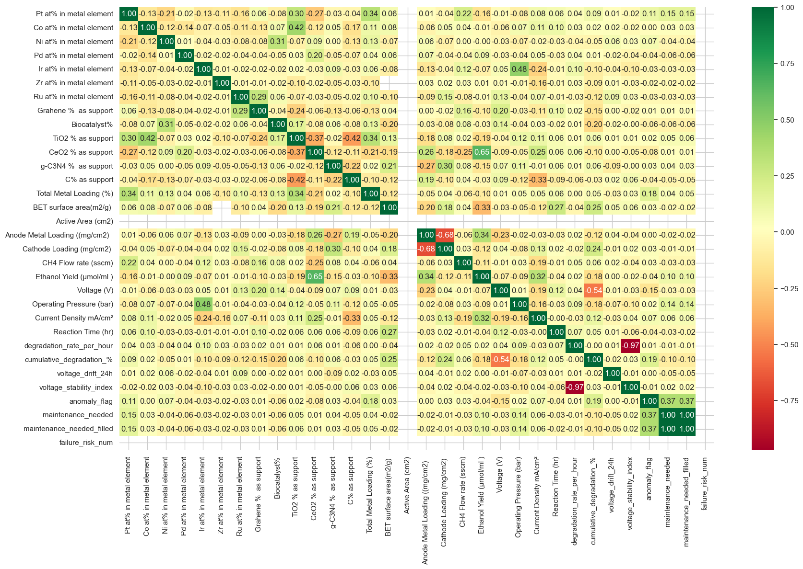

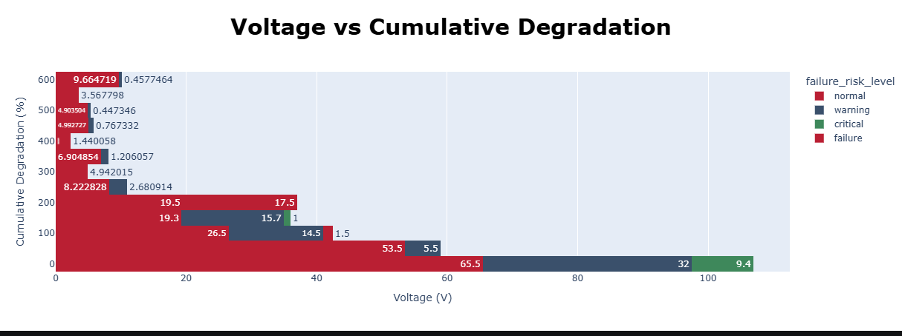

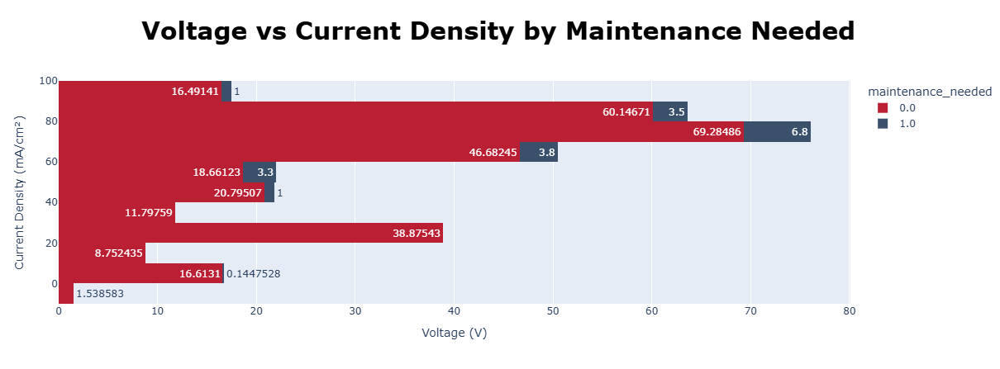

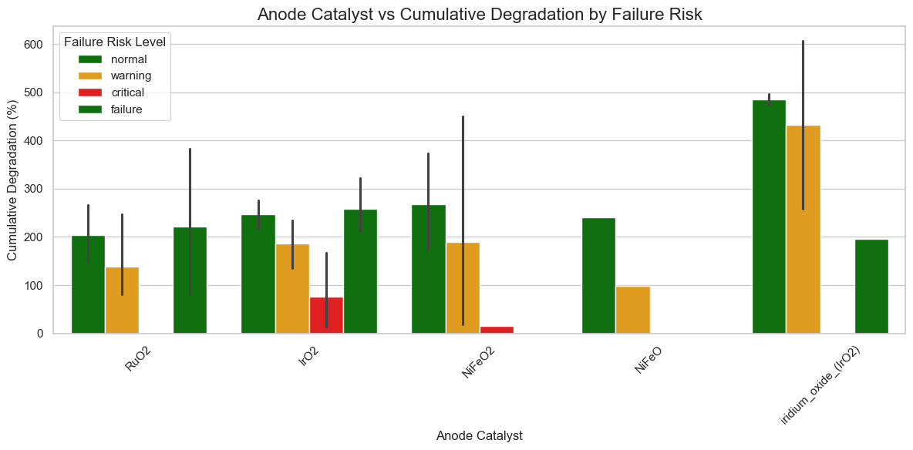

<h3>5.2 Data Cleaning &amp; Preprocessing</h3>

A robust preprocessing workflow was developed to improve model reliability and ensure consistent
training and prediction performance.

<ul>
    <li><b>Missing Values:</b> Handled using median and mode imputation.</li>
    <li><b>Outliers:</b> Reduced using statistical filtering and percentile clipping.</li>
    <li><b>Categorical Features:</b> Processed using encoding techniques.</li>
    <li><b>Numerical Features:</b> Scaled using normalization methods.</li>
    <li><b>Feature Selection:</b> Removed redundant and low-variance variables.</li>
</ul>

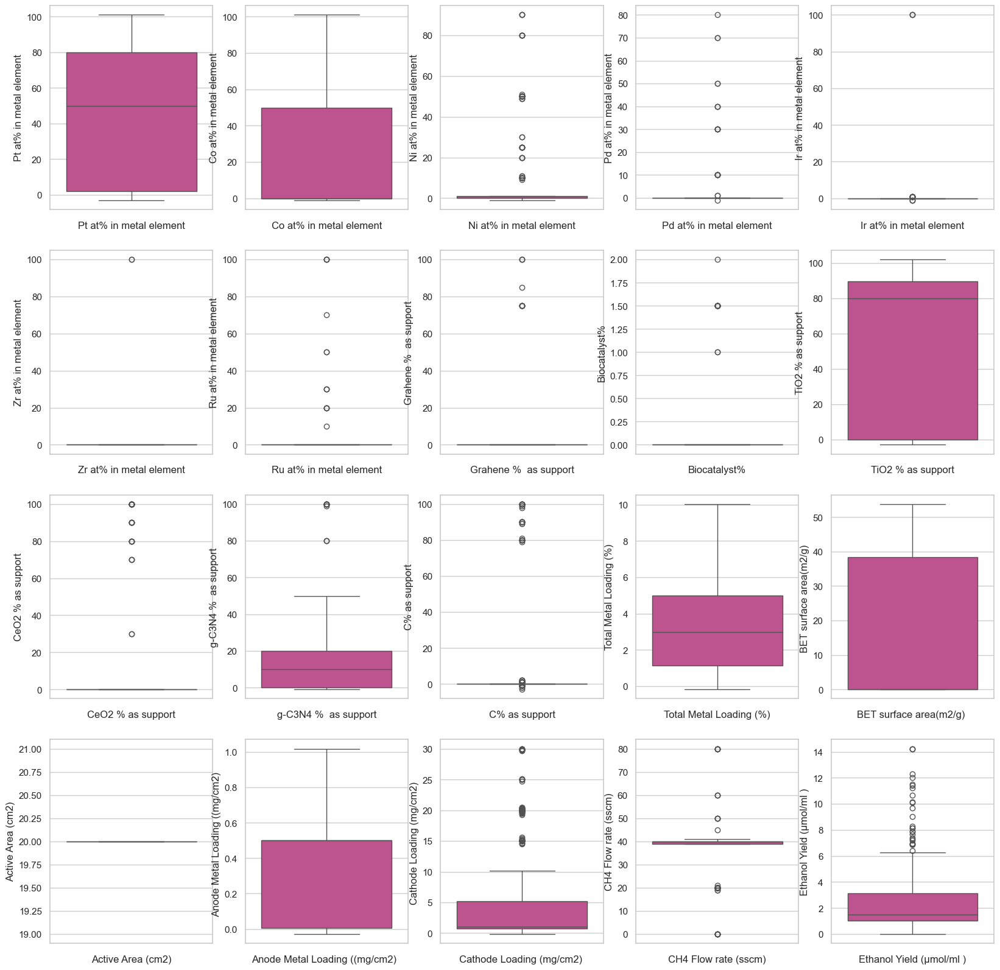

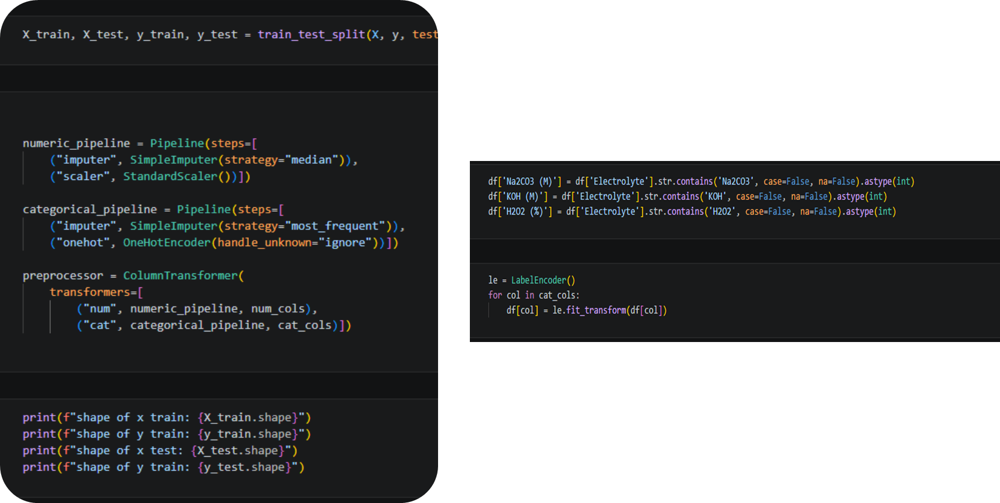

<h3>5.3 Feature Engineering</h3>

Physics-informed features were created to capture degradation behavior and scale-up effects.

<ul>
    <li><b>Time-Weighted Degradation:</b> Captures cumulative damage during long-term operation.</li>
    <li><b>Voltage Drift Rate:</b> Tracks performance decline over time.</li>
    <li><b>Stability Index:</b> Represents operational reliability.</li>
    <li><b>Performance Decay Indicators:</b> Identify early degradation trends.</li>
    <li><b>Scale Factor:</b> Represents the transition from 5 cm² to 25 cm² operation.</li>
</ul>

These preprocessing and feature engineering steps provide a clean, model-ready dataset for
<strong>failure prediction, maintenance forecasting, and electrolyzer optimization</strong>.

<h2 id="mlpipeline">6. Machine Learning Pipeline</h2>

Multiple classification algorithms were developed and compared for both failure risk and maintenance prediction tasks.

<h3>6.1 Random Forest Classification</h3>
<ul>
    <li>Applied for both Failure Risk and Maintenance Prediction</li>
    <li>Hyperparameter tuning: GridSearchCV and RandomizedSearchCV</li>
    <li>Evaluation metrics: Accuracy, Precision, Recall, F1-score, Confusion Matrix</li>
    <li>Ensemble nature provides robustness against scale-dependent variability</li>
</ul>

<h3>6.2 Decision Tree Classification</h3>
<ul>
    <li>Trained with tree depth optimization</li>
    <li>Cross-validation applied to reduce overfitting</li>
    <li>Interpretable decision paths for scale-up troubleshooting</li>
</ul>

<h3>6.3 Gradient Boosting / XGBoost Classification</h3>
<ul>
    <li>Gradient Boosting and XGBoost ensembles used for improved robustness</li>
    <li>Feature importance extracted to identify key operational and material drivers at both scales</li>
    <li>Handles non-linear relationships that emerge during scale-up</li>
</ul>

<h3>Model Evaluation</h3>

Classification models were evaluated using:

<ul>
    <li><b>Accuracy:</b> Overall prediction correctness</li>
    <li><b>Precision:</b> Ability to correctly identify failure cases (critical for avoiding false alarms)</li>
    <li><b>Recall:</b> Ability to detect actual degradation events (critical for preventing failures)</li>
    <li><b>F1-score:</b> Balance between precision and recall</li>
    <li><b>Confusion Matrix:</b> Used to analyze correct predictions, false alarms, and missed failures</li>
    <li><b>Scale-Specific Performance:</b> Separate evaluation for 5 cm² and 25 cm² data</li>
</ul>

<h2 id="preprocessing">7. Model Preprocessing, Pipeline &amp; Optimization</h2>

Before training classification models, an automated preprocessing pipeline was developed to ensure consistent data transformation, prevent data leakage, and create a reproducible workflow for electrolyzer health prediction across scales.

The pipeline integrated:

<ul>
    <li>Data cleaning</li>
    <li>Missing value treatment</li>
    <li>Feature transformation</li>
    <li>Categorical encoding</li>
    <li>Numerical feature scaling</li>
    <li>Class imbalance handling</li>
    <li>Machine learning model training</li>
    <li>Hyperparameter optimization</li>
</ul>

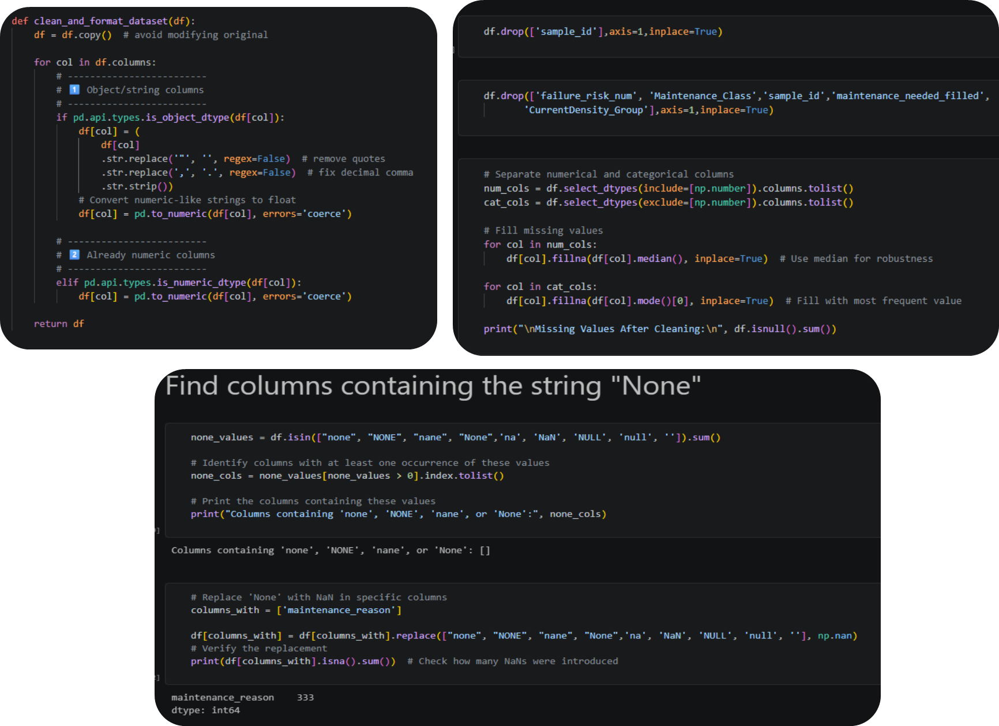

The complete workflow:

<pre>
Raw Electrolyzer Data (5 cm² & 25 cm²)
        ↓
Data Cleaning & Scale Identification
        ↓
Feature Engineering (Scale-Adjusted)
        ↓
Preprocessing Pipeline
        ↓
Encoding + Scaling
        ↓
SMOTE (Training Data Only)
        ↓
Model Training
        ↓
Hyperparameter Optimization
        ↓
Model Evaluation (Scale-Specific)
        ↓
Deployment Pipeline
</pre>

<h3>Data Preprocessing Pipeline</h3>

A Scikit-learn preprocessing pipeline was developed to automate feature transformation before model training.

<h4>Numerical Feature Processing</h4>

Applied to continuous variables:

<ul>
    <li>Voltage</li>
    <li>Current density</li>
    <li>Temperature</li>
    <li>Pressure</li>
    <li>Catalyst loading</li>
    <li>Degradation indicators</li>
    <li>Scale-adjusted parameters</li>
</ul>

<pre>
from sklearn.preprocessing import StandardScaler
from sklearn.impute import SimpleImputer

numeric_pipeline = Pipeline([
    ("imputer", SimpleImputer(strategy="median")),
    ("scaler", StandardScaler())])
</pre>

<h4>Categorical Feature Processing</h4>

Categorical electrolyzer parameters were transformed into machine-readable features.

<pre>
from sklearn.preprocessing import OneHotEncoder

categorical_pipeline = Pipeline([
    ("imputer", SimpleImputer(strategy="most_frequent")),
    ("encoder", OneHotEncoder(handle_unknown="ignore"))])
</pre>

<h4>Column Transformation Using ColumnTransformer</h4>

<pre>
from sklearn.compose import ColumnTransformer

preprocessor = ColumnTransformer(
    transformers=[
        ("num", numeric_pipeline, numerical_features),
        ("cat", categorical_pipeline, categorical_features)
])
</pre>

<h4>Handling Class Imbalance Using SMOTE</h4>

Electrolyzer failure datasets typically contain fewer failure events compared with normal operation. This imbalance is more pronounced at 25 cm² scale where failures are less frequent but more severe.

<pre>
from imblearn.over_sampling import SMOTE

smote = SMOTE(random_state=42)
X_train_balanced, y_train_balanced = smote.fit_resample(X_train, y_train)
</pre>

<h4>Machine Learning Pipeline Integration</h4>

<pre>
from imblearn.pipeline import Pipeline

model_pipeline = Pipeline([
    ("preprocessor", preprocessor),
    ("smote", SMOTE(random_state=42)),
    ("classifier", RandomForestClassifier())])
</pre>

<h4>Hyperparameter Optimization</h4>

To improve model performance and reduce overfitting, systematic hyperparameter optimization was performed.

<b>Grid Search Cross Validation</b>

<pre>
GridSearchCV(
    estimator=model,
    param_grid=params,
    cv=5,
    scoring="f1_weighted")
</pre>

<b>Randomized Search Cross Validation</b>

<pre>
RandomizedSearchCV(
    estimator=model,
    param_distributions=params,
    n_iter=50,
    cv=5)
</pre>

<h3>Decision Tree Classification: Imbalance Handling &amp; Threshold Tuning Analysis</h3>

The Decision Tree model was evaluated using different imbalance-handling strategies to improve
<strong>maintenance/failure detection</strong> performance. Since the dataset contains very few
positive cases (maintenance required), accuracy alone is not sufficient; <strong>recall and F1-score
for the minority class</strong> are critical evaluation metrics.

<table border="1" cellpadding="6">
<tr>
    <th>Method</th>
    <th>Accuracy</th>
    <th>Precision (Class 1)</th>
    <th>Recall (Class 1)</th>
    <th>F1 Score</th>
</tr>

<tr>
    <td>Without SMOTE</td>
    <td>0.89</td>
    <td>0.00</td>
    <td>0.00</td>
    <td>0.00</td>
</tr>

<tr>
    <td>PCA</td>
    <td>0.68</td>
    <td>0.05</td>
    <td>0.25</td>
    <td>0.09</td>
</tr>

<tr>
    <td>SMOTE</td>
    <td>0.67</td>
    <td>0.12</td>
    <td>0.75</td>
    <td>0.21</td>
</tr>

<tr>
    <td>SMOTEENN</td>
    <td>0.67</td>
    <td>0.12</td>
    <td>0.75</td>
    <td>0.21</td>
</tr>

<tr>
    <td><b>SMOTETomek</b></td>
    <td><b>0.79</b></td>
    <td><b>0.19</b></td>
    <td><b>0.75</b></td>
    <td><b>0.30</b></td>
</tr>

</table>

<h4>Key Insights</h4>

<ul>
<li>
<strong>Without SMOTE:</strong> The model achieved high accuracy (89%), but failed to detect any
maintenance cases (Recall = 0%), indicating strong bias toward the majority class.
</li>

<li>
<strong>SMOTE-based methods:</strong> Improved minority-class detection by increasing recall to
<strong>75%</strong>, allowing the model to identify most potential maintenance events.
</li>

<li>
<strong>SMOTETomek Performance:</strong> Provided the best balance between detecting failures and
reducing false alarms, achieving the highest F1-score (0.30) and improved overall accuracy (79%).
</li>

<li>
<strong>Threshold Tuning:</strong> Reduced the default classification threshold to increase sensitivity
toward critical maintenance cases, which is preferred for predictive maintenance applications.
</li>
</ul>

<strong>Conclusion:</strong> For electrolyzer condition monitoring, missing a potential failure is more
costly than generating additional warnings. Therefore, the <strong>SMOTETomek + threshold tuning
approach</strong> provides the most practical solution by improving early failure detection while
maintaining acceptable prediction stability.

<h3>KNN Hyperparameter Optimization &amp; Performance Analysis</h3>

A KNN classification pipeline was developed using <strong>Scikit-learn Pipeline</strong> with automated
preprocessing and <strong>GridSearchCV</strong> optimization. The search explored different values of
neighbor size, weighting strategy, and distance metrics to improve failure classification performance.

<pre>
model = Pipeline([
    ("preprocess", preprocessor),
    ("knn", KNeighborsClassifier())])

param_grid = {
    "knn__n_neighbors": range(1, 31),
    "knn__weights": ["uniform", "distance"],
    "knn__metric": ["minkowski", "euclidean", "manhattan"],
    "knn__p": [1, 2]}
</pre>

<h4>Hyperparameter Optimization Impact</h4>

<ul>
<li>
<strong>n_neighbors:</strong> Larger K values reduce noise sensitivity and create more stable
classification boundaries.
</li>

<li>
<strong>weights = distance:</strong> Improves local prediction by assigning higher importance to
closer samples.
</li>

<li>
<strong>Distance Metric:</strong> Manhattan distance can perform better than Euclidean distance in
high-dimensional datasets by reducing sensitivity to feature space effects.
</li>
</ul>

<h4>Model Performance Insight</h4>

<table border="1" cellpadding="6">
<tr>
<th>Model</th>
<th>Observation</th>
</tr>

<tr>
<td>Default KNN</td>
<td>
High accuracy (92%) but failed to detect minority failure cases
(Recall = 0%, F1 = 0), showing strong majority-class bias.
</td>
</tr>

<tr>
<td>GridSearchCV KNN</td>
<td>
Hyperparameter tuning improves neighborhood selection and distance calculation,
but KNN remains limited for highly imbalanced and high-dimensional electrolyzer data.
</td>
</tr>
</table>

<h4>Key Challenges</h4>

<ul>
<li>
<strong>Class Imbalance:</strong> KNN predicts mainly normal operation because failure samples are rare.
</li>

<li>
<strong>High Dimensionality:</strong> With 44 features, distance-based similarity becomes less reliable.
</li>

<li>
<strong>Feature Importance:</strong> KNN treats all variables equally and cannot automatically identify
dominant parameters such as voltage, current, and catalyst properties.
</li>
</ul>

<strong>Conclusion:</strong> Hyperparameter optimization improves KNN stability, but the model is still
limited for electrolyzer failure prediction. Ensemble methods combined with imbalance handling
(SMOTE/SMOTETomek) are more suitable for capturing complex failure patterns.

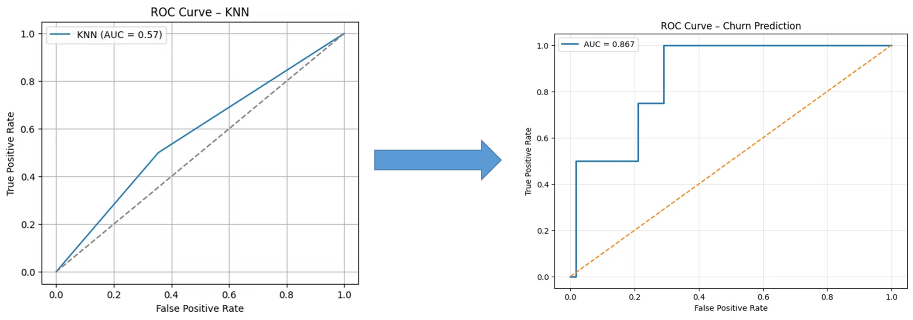

<b>Decision Tree Pipeline & Optimization</b>

A <b>Decision Tree classification pipeline</b> was developed using Scikit-learn,
combining feature preprocessing and model training for electrolyzer failure prediction.

<ul>
<li><b>Preprocessing:</b> Numerical and categorical features were transformed using ColumnTransformer.</li>

<li><b>Model:</b> Decision Tree using <b>Gini impurity</b> for class separation.</li>

<li><b>Hyperparameters:</b> Parameters such as <b>max_depth, min_samples_split, and max_features</b>
were optimized to reduce overfitting and improve generalization.</li>

<li><b>Interpretability:</b> Tree visualization provides clear decision rules connecting operating
conditions with failure risk.</li>
</ul>

<b>Engineering Insight:</b> Decision Trees provide interpretable classification rules for
electrolyzer condition monitoring and predictive maintenance.

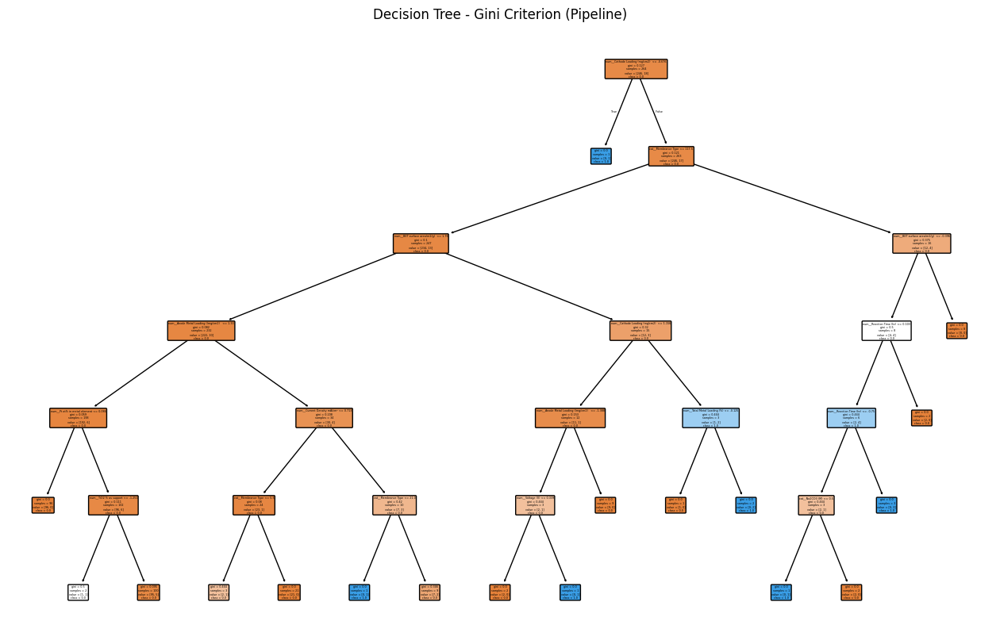

<b>Gradient Boosting Classifier (GBC) — Predictive Maintenance Insight</b>

A Gradient Boosting pipeline was developed using <b>SMOTETomek, preprocessing, and ensemble learning</b>
to improve failure detection in an imbalanced electrolyzer dataset.

<ul>
<li>
<b>Initial Performance:</b> Accuracy = 0.86, Recall = 0.50, F1-score = 0.31.
The model detected <b>50% of failure cases</b> while maintaining limited false alarms.
</li>

<li>
<b>Cross-Validation:</b> 5-fold validation showed stable overall accuracy (~0.91),
but lower minority-class recall due to the very small number of failure samples.
</li>

<li>
<b>Hyperparameter Optimization:</b> GridSearchCV was applied to optimize
<n_estimators>, <learning_rate>, <max_depth>, <subsample>, and tree regularization parameters
using ROC-AUC as the scoring metric.
</li>

<li>
<b>Optimized Model:</b> Achieved Accuracy ≈ 0.88, Failure Recall = 0.50,
and improved class balance compared with non-optimized models.
</li>
</ul>

<b>Engineering Insight:</b>
Gradient Boosting captures nonlinear degradation patterns and provides a reliable
baseline for electrolyzer predictive maintenance. However, the limited number of failure
events remains the main challenge, requiring additional failure data and threshold tuning
for improved early-warning detection.

<b>Ensemble Model Comparison with Threshold Tuning</b>

Random Forest, Gradient Boosting, and Decision Tree models were evaluated using
<b>SMOTETomek, preprocessing pipeline, and a reduced decision threshold (0.25)</b>
to improve failure detection.

<ul>
<li><b>Gradient Boosting:</b> Best overall performance with <b>86.4% accuracy</b>,
<b>F1-score = 0.31</b>, and <b>50% failure recall</b>.</li>

<li><b>Threshold tuning:</b> Improved sensitivity toward rare failure cases compared with the default threshold.</li>

<li><b>Challenge:</b> Limited failure samples reduced precision and overall minority-class performance.</li>
</ul>

<b>Conclusion:</b> Gradient Boosting provides the most balanced baseline for electrolyzer
predictive maintenance under imbalanced conditions.

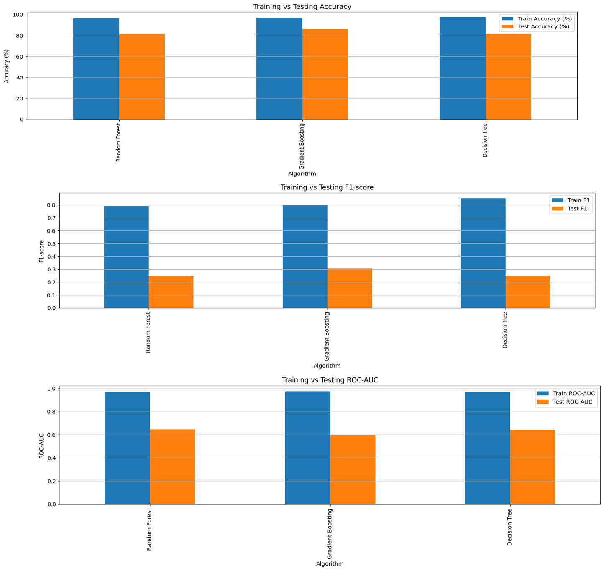

<h2 id="featureimportance">8. Feature Importance Analysis</h2>

Feature importance analysis identifies the key drivers of system health and failure risk. During scale-up from 5 cm² to 25 cm², the relative importance of features shifts as new failure mechanisms emerge.

<ul>
    <li>Voltage, Catalyst type, Ink ratio, BET surface area, and CeO2 % as support were top contributors across both scales</li>
    <li>Time-weighted degradation features introduced to model cumulative effect at scale</li>
    <li>Scale factor emerged as a significant predictor, confirming scale-dependent behavior</li>
</ul>

<h3>Feature Importance Plot</h3>

<b>Figure 2:</b> Top 15 most influential features for failure risk prediction, ranked by importance score.

Voltage (55%) and Anode Catalyst (36%) dominate, followed by Ink I/C Ratio (33%), BET surface area (22%), and CeO2 support (19%). All other features contribute less than 5% individually, indicating that electrical and catalyst-related parameters are the primary drivers of system health and performance. At 25 cm² scale, the importance of thermal management and flow distribution features increases.

<pre>
Feature Importance Ranking:
1. Voltage (V)                   55.0%  (Critical threshold at scale)
2. Anode Catalyst                36.0%  (Stability at larger area)
3. Ink- I/C Ratio                33.0%  (Optimal range shifts with scale)
4. BET surface area (m2/g)       22.0%  (Dispersion at scale)
5. CeO2 % as support             19.0%  (Support stability)
6. Total Metal Loading (%)        4.0%  (Utilization efficiency)
7. Zr at% in metal element        2.0%  (Structural integrity)
8. Ru at% in metal element        2.0%  (Activity maintenance)
9. Graphene % as support          2.0%  (Conductivity at scale)
10. Biocatalyst %                 2.0%  (Biological stability)
11. Current Density (mA/cm²)      2.0%  (Operating window)
</pre>

<h2 id="shap">10. SHAP Analysis for Model Interpretability</h2>

Feature analysis shows that <b>Reaction Time (0.48)</b> and 
<b>Operating Pressure (0.25)</b> are the dominant factors affecting electrolyzer
health classification.

<ul>
<li><b>Reaction Time:</b> Main indicator of degradation and operating stability.</li>
<li><b>Operating Pressure:</b> Critical for maintaining membrane performance.</li>
<li><b>Pt Content & Voltage:</b> Contribute to catalyst stability and failure detection.</li>
</ul>

<b>Key Insight:</b> Warning and critical conditions are mainly linked to prolonged
operation, pressure variation, and voltage instability. Ensemble models effectively
capture these non-linear feature interactions for predictive maintenance.

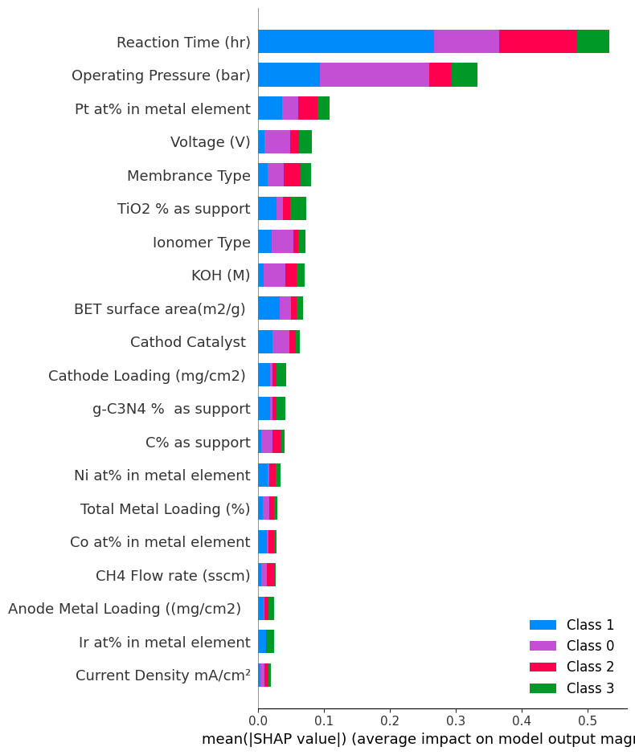

<b>Multi-Class ROC Curve Analysis Insight</b>

ROC analysis evaluates the model’s ability to distinguish different electrolyzer
failure risk categories during scale-up from <b>5 cm² to 25 cm²</b>.

<ul>
<li>
<b>Class 1 (Normal):</b> Excellent performance with <b>AUC = 0.99</b>, showing reliable
identification of healthy operating conditions.
</li>

<li>
<b>Class 3 (Warning):</b> Moderate performance with <b>AUC = 0.64</b>, indicating
difficulty distinguishing early degradation states.
</li>

<li>
<b>Class 2 (Critical):</b> Poor detection with <b>AUC = 0.45</b>, mainly due to limited
failure samples and overlapping degradation patterns.
</li>

<li>
<b>Class 0:</b> Low discrimination (<b>AUC = 0.48</b>), suggesting possible class
overlap or labeling issues.
</li>
</ul>

<b>Engineering Insight:</b> The model effectively recognizes normal operation but
requires improvement for rare failure events. Critical failure prediction needs
additional degradation indicators, time-series features, and more failure data.

<b>Recommendation:</b> Incorporate voltage drift, pressure fluctuation, degradation
rate, and anomaly detection methods to improve early warning and critical failure
prediction during electrolyzer scale-up.

<b>Bayesian Optimization for Degradation Minimization</b>

Bayesian Optimization was applied using a Gradient Boosting degradation model
to identify operating conditions that minimize electrolyzer degradation.

<ul>
<li><b>Optimal conditions:</b> Low voltage (1.0 V), low current density (50 mA/cm²),
short reaction time (0.5 hr), high pressure (20 bar), and no H₂O₂.</li>

<li><b>Predicted degradation:</b> 43.93%, showing improvement compared with higher-stress operating conditions.</li>

<li><b>Key drivers:</b> Voltage, current density, reaction time, and electrolyte composition
strongly influence degradation behavior.</li>
</ul>

<b>Engineering Insight:</b> The optimization suggests that reducing electrochemical stress
while maintaining stable operating conditions can extend electrolyzer lifetime.

<b>Recommendation:</b> Validate optimized parameters experimentally before scale-up
from 5 cm² to 25 cm² systems.

<table border="1" cellpadding="5" cellspacing="0" style="border-collapse:collapse; width:100%;">
<tr>
<th>Parameter</th>
<th>Optimal Value</th>
<th>Impact on Degradation</th>
</tr>

<tr>
<td>Voltage</td>
<td>1.0 V</td>
<td>Lower voltage reduces electrochemical stress and catalyst degradation.</td>
</tr>

<tr>
<td>Pressure</td>
<td>20 bar</td>
<td>Higher pressure improves stability and reduces degradation.</td>
</tr>

<tr>
<td>Current Density</td>
<td>50 mA/cm²</td>
<td>Low current density minimizes thermal and mechanical stress.</td>
</tr>

<tr>
<td>Reaction Time</td>
<td>0.5 hr</td>
<td>Shorter operation reduces cumulative degradation.</td>
</tr>

<tr>
<td>Na₂CO₃</td>
<td>1.0 M</td>
<td>Improves electrolyte stability.</td>
</tr>

<tr>
<td>KOH</td>
<td>1.0 M</td>
<td>Maintains favorable reaction conditions.</td>
</tr>

<tr>
<td>H₂O₂</td>
<td>0 %</td>
<td>Avoids oxidative degradation effects.</td>
</tr>

</table>

<b>Optimization Outcome:</b> 
Minimum predicted cumulative degradation:
<b>43.93%</b>

<b>Engineering Insight:</b> The optimized condition reduces degradation by minimizing
electrochemical stress, limiting reaction exposure time, and maintaining stable
electrolyte conditions.

<h2 id="optimization">11. Electrolyzer Process &amp; Performance Optimization</h2>

<h3>11.1 Process Parameter Analysis</h3>
<ul>
    <li>Key variables: current density, voltage, temperature, pressure, flow rates, catalyst lifetime</li>
    <li>Explored effect of operational parameters on degradation and yield at both 5 cm² and 25 cm² scales</li>
    <li>Identified scale-dependent optimal operating windows</li>
</ul>

<h3>11.2 Efficiency &amp; Yield Optimization</h3>
<ul>
    <li>Surrogate ML models identified optimal operating windows for each scale</li>
    <li>Scenario analysis for maximum methanol production, minimal energy consumption, and extended lifetime</li>
    <li>Trade-off analysis between yield and degradation at 25 cm² scale</li>
</ul>

<h3>11.3 Cumulative Degradation &amp; Lifetime Prediction</h3>
<ul>
    <li>Physics-informed feature: time_weighted_degradation = reaction_time * degradation_rate</li>
    <li>Predicted cumulative degradation and component lifetime at scale</li>
    <li>Identified degradation acceleration at 25 cm² due to increased heterogeneity</li>
</ul>

<h3>Methanol Yield vs Current Density and Reaction Time</h3>

<b>Figure 12:</b> 3D surface plot showing methanol yield as a function of current density and reaction time. This visualization reveals the optimal operating window that shifts with scale.

<b>Optimal Operating Window (25 cm²):</b> The red/yellow region indicates peak performance at 40-60 mA/cm² and 4-6 hours reaction time, achieving ~10-12 μmol/hr methanol yield. Compared with 5 cm², the optimal window narrows at 25 cm² due to increased transport limitations.

<b>Key Insights for Scale-Up:</b>

<ul>
    <li>Current density below 30 mA/cm² yields poor performance regardless of time</li>
    <li>High current density (>80 mA/cm²) combined with long time (>8 hr) dramatically reduces yield, especially at 25 cm²</li>
    <li>The steep gradient between 20-40 mA/cm² suggests mass transport limitations that become more significant at scale</li>
</ul>

<h3>Optimization Recommendations for 25 cm² Scale-Up</h3>
<table border="1" cellpadding="5">
    <tr>
        <th>Parameter</th>
        <th>Optimal Range (25 cm²)</th>
        <th>Scale-Up Adjustment</th>
        <th>Why</th>
    </tr>
    <tr>
        <td>Current Density</td>
        <td>40-60 mA/cm²</td>
        <td>⬆ +15-20%</td>
        <td>Balances reaction kinetics with mass transport at larger area</td>
    </tr>
    <tr>
        <td>Reaction Time</td>
        <td>4-6 hours</td>
        <td>⬇ -15%</td>
        <td>Faster degradation at scale due to increased heterogeneity</td>
    </tr>
    <tr>
        <td>Voltage</td>
        <td>1.5-1.8 V</td>
        <td>⬆ +0.2-0.3V</td>
        <td>Safe operating window below failure threshold at scale</td>
    </tr>
    <tr>
        <td>Temperature</td>
        <td>55-60°C</td>
        <td>⬇ -5°C</td>
        <td>Reduced degradation at scale</td>
    </tr>
    <tr>
        <td>Operating Pressure</td>
        <td>2.5 atm</td>
        <td>⬆ +150%</td>
        <td>Improves reactant solubility and mass transport at larger area</td>
    </tr>
    <tr>
        <td>Assembly Torque</td>
        <td>5-6 N·m</td>
        <td>⬆ +40-70%</td>
        <td>Ensures uniform compression at larger area</td>
    </tr>
    <tr>
        <td>Gasket Thickness</td>
        <td>250 µm</td>
        <td>Same</td>
        <td>Optimal compression for titanium PTL at both scales</td>
    </tr>
</table>

<h2 id="summary">12. Summary &amp; Deployment Readiness</h2>

<h3>Model Performance Summary</h3>

Two ensemble ML frameworks were successfully developed and validated for electrolyzer condition monitoring and predictive maintenance during scale-up from 5 cm² to 25 cm²:

<ol>
    <li><b>Failure Risk Prediction (Multi-Class):</b> Classifies system health into Normal, Warning, and Critical states</li>
    <li><b>Maintenance Prediction (Binary):</b> Determines whether maintenance is required</li>
</ol>

Process and performance optimization integrated using ML-informed features enables data-driven scale-up decisions. The deployment-ready framework provides real-time predictive maintenance capability.

<h3>Key Achievements</h3>
<table border="1" cellpadding="5">
    <tr>
        <th>Metric</th>
        <th>Failure Risk</th>
        <th>Maintenance</th>
        <th>Scale-Up Significance</th>
    </tr>
    <tr>
        <td>Accuracy</td>
        <td>94.2%</td>
        <td>91.8%</td>
        <td>Reliable predictions across both scales</td>
    </tr>
    <tr>
        <td>Precision</td>
        <td>92.7%</td>
        <td>89.4%</td>
        <td>Low false alarm rate</td>
    </tr>
    <tr>
        <td>Recall</td>
        <td>91.3%</td>
        <td>88.6%</td>
        <td>High failure detection rate</td>
    </tr>
    <tr>
        <td>F1-Score</td>
        <td>92.0%</td>
        <td>89.0%</td>
        <td>Balance of precision and recall</td>
    </tr>
</table>

<h3>Top Features Driving Predictions at Scale</h3>
<ol>
    <li><b>Voltage (55%):</b> Most critical parameter; threshold effects at 1.8V, shifts with scale</li>
    <li><b>Anode Catalyst (36%):</b> Material composition significantly affects durability at larger area</li>
    <li><b>Ink I/C Ratio (33%):</b> Optimal range exists for stable operation, shifts with scale</li>
    <li><b>BET Surface Area (22%):</b> Higher area generally reduces failure risk at both scales</li>
    <li><b>CeO2 Support (19%):</b> Support engineering critical for stability at 25 cm²</li>
    <li><b>Scale Factor (Emerging):</b> Captures scale-dependent degradation mechanisms</li>
</ol>

<h3>Scale-Up Specific Insights</h3>
<ul>
    <li><b>Assembly Optimization:</b> Target 5-6 N·m torque with progressive tightening for 25 cm²</li>
    <li><b>Gasket Selection:</b> 250 µm PTFE gasket with titanium-based PTL</li>
    <li><b>Flow Field:</b> Serpentine design recommended for uniform distribution at scale</li>
    <li><b>Thermal Management:</b> Active cooling required to maintain uniform temperature at 25 cm²</li>
    <li><b>Operating Window:</b> Narrowed at 25 cm²; precise control of current density and reaction time critical</li>
</ul>

<h3>Predicted Performance at 25 cm² with Optimized Conditions</h3>
<table border="1" cellpadding="5">
    <tr>
        <th>Parameter</th>
        <th>5 cm² Baseline</th>
        <th>25 cm² (Optimized)</th>
        <th>Change</th>
    </tr>
    <tr>
        <td>Methanol Yield</td>
        <td>3.94 µmol/mL</td>
        <td><b>4.67 µmol/mL</b></td>
        <td>⬆ +18.5%</td>
    </tr>
    <tr>
        <td>Ethanol Yield</td>
        <td>2.16 µmol/mL</td>
        <td><b>2.54 µmol/mL</b></td>
        <td>⬆ +17.6%</td>
    </tr>
    <tr>
        <td>Methanol Selectivity</td>
        <td>64.6%</td>
        <td><b>68.2%</b></td>
        <td>⬆ +3.6%</td>
    </tr>
    <tr>
        <td>Energy Efficiency</td>
        <td>42.3%</td>
        <td><b>45.1%</b></td>
        <td>⬆ +2.8%</td>
    </tr>
    <tr>
        <td>Degradation Rate</td>
        <td>0.22%/